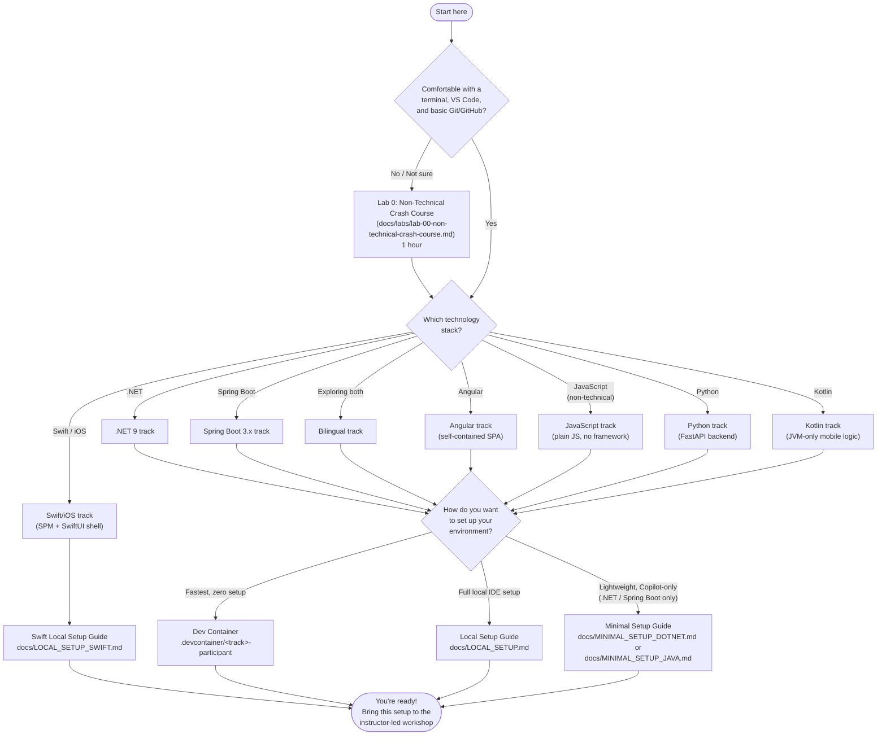

# Workshop: Using AI for Application Development with GitHub Copilot (Bilingual Edition)

## Overview

Transform the way you build software with AI-powered development! This comprehensive workshop teaches developers how to leverage **GitHub Copilot** and modern AI coding assistants to accelerate application development while maintaining high code quality standards.

**Choose Your Technology Stack:** This workshop supports both **🔷 .NET** and **🟩 Spring Boot** implementations, allowing participants to learn AI-assisted development in their preferred ecosystem. Additional tracks include **🅰️ Angular** (a self-contained SPA, no backend), **🟨 JavaScript** (for non-technical participants), **🐍 Python** (FastAPI backend), **🅺 Kotlin** (JVM-only, mobile-oriented logic modules with no Android SDK or emulator for Labs 1-4), and **🍎 Swift** (a Swift Package plus a minimal SwiftUI iOS shell, macOS/Xcode local setup only) — see the [Getting Started](#getting-started-choose-your-path) flowchart below.

**This workshop is split into two parts:**

### Part 1: Fundamentals (3 hours)
Learn AI assistance across the entire development lifecycle—from requirements gathering to code generation, testing, and documentation. Using either **.NET 9** or **Spring Boot 3.x**, **Visual Studio Code**, and **GitHub Copilot**, you'll experience firsthand how AI can amplify developer productivity while following industry best practices like **Clean Architecture**, **Domain-Driven Design**, and **Test-Driven DLearn AI assistance across the entire development lifecycle, from requirements gathering to code generation, testing, and documentation. Using either **.NET 9** or **Spring Boot 3.x**, **Visual Studio Code**, and **GitHub Copilot**, you'll experience firsthand how AI can amplify developer productivity while following industry best practices such as **Clean Architecture**, **Domain‑Driven Design**, and **Test‑Driven Development**.evelopment**.

### Part 2: Advanced GitHub Copilot (3 hours)
Master advanced Copilot features including **interaction models** (Ask/Plan/Agent), **the Skills system**, **custom agents**, and **workflow automation**. Learn the complete customization hierarchy (Prompts → Instructions → Skills → Agents), discover capabilities with slash commands, and design production-ready agents that encode team knowledge and standardize AI-assisted development workflows.

**Full workshop duration:** 6 hours (can be delivered as separate sessions or combined)

**What makes this workshop unique:**
- **Bilingual support**: Choose .NET or Spring Boot—same concepts, your technology stack
- **Practical, hands-on labs** with real-world scenarios, not just demos
- **Complete customization hierarchy**: Instructions, Skills, and Agents working together
- **Enterprise-grade patterns** including Clean Architecture and DDD
- **TDD-first approach** with AI generating tests before implementation  
- **Pre-configured dev environment** via VS Code Dev Containers for most tracks, plus a dedicated macOS/Xcode local setup for the Swift/iOS track
- **Repository-level Copilot instructions** with context-aware loading per technology stack
- **Skills exploration** with working examples (test-data-generator) showcasing domain knowledge without tool access
- **Production-ready agent design** including handoffs, invocation control, and governance patterns
- **Modern stacks**: .NET 9 with Minimal APIs and OpenTelemetry OR Spring Boot 3.x with actuators
- **Enterprise Java modernization scenarios**: Includes Mule ESB → Spring Boot refactoring examples

Whether you're new to AI-assisted development or looking to level up your Copilot skills, this workshop provides the practical experience and best practices you need to integrate AI into your daily workflow effectively.

This repository contains all workshop materials including lab guides, starter code, reference implementations, and facilitator resources.

---

## Getting Started: Choose Your Path

Not sure where to start? Answer a couple of quick questions and follow the path that fits you:



> **This is an instructor-led workshop.** The steps above are pre-workshop preparation only — complete them before the session so your environment is ready. Your facilitator will guide the group through Lab 1 and beyond during the live workshop.

- **New to the terminal, VS Code, or Git?** Complete **[Lab 0: Non-Technical Crash Course](docs/labs/lab-00-non-technical-crash-course.md)** (1 hour, [companion slides](docs/presentations/modules/pre-workshop/00-non-technical-crash-course.md)) before the workshop.
- **Already comfortable with the basics?** Pick a stack and environment below so you arrive ready — see the [Pre-Workshop Environment Checklist](docs/PRE_WORKSHOP_CHECKLIST.md).

---

## VS Code & Devcontainer Setup


For the best experience, use the provided **Devcontainer** and recommended VS Code settings:

- **Devcontainer Options** (choose based on your stack):
  - 🔷 **.NET Container** (`.devcontainer/dotnet/`): .NET 9 SDK, C# Dev Kit, xUnit extensions
  - 🟩 **Spring Boot Container** (`.devcontainer/springboot/`): Java 21 JDK, Spring Boot extensions, Maven
  - 🔷🟩 **Bilingual Container** (`.devcontainer/bilingual/`): Both .NET and Java environments (for facilitators or exploring both stacks)
  - 🅰️ **Angular Container** (`.devcontainer/angular-participant/`): Node 24+, Angular CLI, Angular Language Service (self-contained SPA, no backend)
  - 🟨 **JavaScript Container** (`.devcontainer/javascript-participant/`): Node 22 LTS only, no framework or TypeScript — for the non-technical plain-JS track
  - 🐍 **Python Container** (`.devcontainer/python-participant/`): Python 3.12, Pylance, pytest extension — FastAPI backend track
  - 🅺 **Kotlin Container** (`.devcontainer/kotlin-participant/`): Java 21, Gradle 8+, Kotlin language support — JVM-only track for mobile-oriented domain logic
  - 🍎 **Swift/iOS Track**: **no devcontainer** — use [`docs/LOCAL_SETUP_SWIFT.md`](docs/LOCAL_SETUP_SWIFT.md) on macOS with Xcode and the iOS Simulator

> **Can't use Dev Containers?** Follow the [Local Setup Guide](docs/LOCAL_SETUP.md) to install the required tools and VS Code extensions manually for the .NET, Spring Boot, Angular, JavaScript, Python, or Kotlin track. For the Swift/iOS track, use the standalone [Swift Local Setup Guide](docs/LOCAL_SETUP_SWIFT.md). Prefer a lighter footprint (.NET/Spring Boot only)? See the [Minimal .NET Setup](docs/MINIMAL_SETUP_DOTNET.md) or [Minimal Spring Boot Setup](docs/MINIMAL_SETUP_JAVA.md) for a Copilot-only setup without extra VS Code extensions.
>
> **Angular, JavaScript, Python, and Kotlin tracks**: there is no minimal-setup alternative — use the devcontainer above or follow [`docs/LOCAL_SETUP.md`](docs/LOCAL_SETUP.md) exactly. **Swift/iOS** is also local-only: there is no devcontainer and no minimal alternative for that track.

- **Copilot Custom Instructions**: This repo auto-applies Copilot instructions based on file context:
  - 🔷 **.NET files** (`**/*.cs`): Loads `csharp.instructions.md` + `dotnet.instructions.md`
  - 🟩 **Spring Boot files** (`src-springboot/**`): Loads `springboot.instructions.md`
  - Instructions automatically load from `.github/instructions/` - no manual setup needed!


---
## Prerequisites

## Using the Dev Container (Recommended)

For a fully pre-configured development environment, you can use one of the included **Dev Containers**. This is the fastest way to get started and ensures all required tools and extensions are installed.

**How to use:**
1. Open this repository in VS Code.
2. Open the Command Palette (`Cmd+Shift+P` or `Ctrl+Shift+P`).
3. Select: `Dev Containers: Reopen in Container`
4. **Choose your stack**:
   - 🔷 **.NET Developers**: Select `.devcontainer/dotnet-participant/devcontainer.json`
   - 🟩 **Spring Boot Developers**: Select `.devcontainer/springboot-participant/devcontainer.json`
   - 🔷🟩 **Both Stacks** (facilitators/explorers): Select `.devcontainer/maintainer/devcontainer.json`
   - 🅰️ **Angular Developers**: Select `.devcontainer/angular-participant/devcontainer.json`
   - 🟨 **JavaScript Participants**: Select `.devcontainer/javascript-participant/devcontainer.json`
   - 🐍 **Python Developers**: Select `.devcontainer/python-participant/devcontainer.json`
   - 🅺 **Kotlin Developers**: Select `.devcontainer/kotlin-participant/devcontainer.json`
   - 🍎 **Swift/iOS Developers**: skip devcontainers and follow [`docs/LOCAL_SETUP_SWIFT.md`](docs/LOCAL_SETUP_SWIFT.md), then open `src-swift/TaskManagerApp/TaskManagerApp.xcodeproj` in Xcode
5. VS Code will build and open the project in a container with all tools, SDKs, and extensions.

_This is optional but highly recommended, especially if you want to avoid manual environment setup or ensure consistency across all participants._

Before attending this workshop, participants should have:

**Universal Prerequisites:**
- **GitHub Copilot**: Active subscription and extension installed in VS Code
- **Visual Studio Code**: Latest version
- **Git**: Basic familiarity with git commands
- **GitHub Account**: For cloning repositories and accessing Copilot

**🔷 .NET Track Prerequisites:**
- **.NET 9 SDK**: Installed and verified with `dotnet --version`
- **C# Dev Kit extension** for VS Code
- **C# Experience**: Comfortable with basic C# syntax and concepts

**🟩 Spring Boot Track Prerequisites:**
- **Java 21 JDK**: Installed and verified with `java -version`
- **Maven or Gradle**: For building Spring Boot projects
- **Spring Boot extension pack** for VS Code
- **Java Experience**: Comfortable with basic Java syntax and Spring Framework concepts

**🅰️ Angular Track Prerequisites:**
- **Node.js 24.15+ (or 22.22.3+ / 26.0.0+)**: Installed and verified with `node --version` (a hard requirement of Angular CLI 22)
- **Angular Language Service extension** for VS Code
- **TypeScript/Angular Experience**: Comfortable with basic TypeScript and component-based UI concepts

**🟨 JavaScript Track Prerequisites** (non-technical audience):
- **Node.js (any current LTS)**: Installed and verified with `node --version` — no minimum-version pitfalls like Angular
- **No prior programming experience required**: this track is intentionally lighter-weight (plain functions, no framework, no TypeScript)

**🐍 Python Track Prerequisites:**
- **Python 3.12+**: Installed and verified with `python3 --version`
- **Python extension** for VS Code (plus Pylance)
- **Python Experience**: Comfortable with basic Python syntax; FastAPI experience is helpful but not required

**🅺 Kotlin Track Prerequisites:**
- **Java 21 JDK**: Installed and verified with `java -version`
- **Gradle 8+**: Installed and verified with `gradle --version`
- **Kotlin Language extension** for VS Code
- **Kotlin Experience**: Comfortable with basic Kotlin syntax; Android experience is optional because this track stays JVM-only

**🍎 Swift Track Prerequisites:**
- **macOS with Xcode 15+**: Installed and verified with `xcodebuild -version`
- **Xcode Command Line Tools**: Installed and verified with `swift --version`
- **iOS Simulator**: Available through Xcode for running the SwiftUI shell
- **Swift Experience**: Comfortable with basic Swift syntax; prior SwiftUI experience is helpful but not required

### Environment Check

Run these commands to verify your setup:

**🔷 .NET Track:**
```bash
dotnet --version          # Should show 9.x.x
git --version            # Any recent version
code --version           # VS Code version
```

**🟩 Spring Boot Track:**
```bash
java -version            # Should show Java 21
mvn --version            # Maven version (or gradle --version)
git --version            # Any recent version
code --version           # VS Code version
```

**🅰️ Angular Track:**
```bash
node --version            # Should show v24.15+ (or 22.22.3+ / 26.0.0+)
git --version            # Any recent version
code --version           # VS Code version
```

**🟨 JavaScript Track:**
```bash
node --version            # Any current LTS
git --version            # Any recent version
code --version           # VS Code version
```

**🐍 Python Track:**
```bash
python3 --version         # Should show 3.12.x or later
git --version            # Any recent version
code --version           # VS Code version
```

**🅺 Kotlin Track:**
```bash
java -version            # Should show Java 21
gradle --version         # Should show Gradle 8.x
git --version            # Any recent version
code --version           # VS Code version
```

**🍎 Swift Track:**
```bash
xcodebuild -version      # Should show Xcode 15.x or later
swift --version          # Should show Swift 5.9 or later
git --version            # Any recent version
code --version           # VS Code version
```

### Pre-Workshop Preparation

**Participants**: Please complete the [Pre-Workshop Environment Checklist](docs/PRE_WORKSHOP_CHECKLIST.md) **before** attending the workshop to ensure your environment is fully configured. This will allow us to maximize hands-on learning time.

---

## Learning Objectives

### Part 1: Fundamentals

By the end of Part 1, participants will be able to:

- **Leverage context-aware Copilot Instructions** (`.github/instructions/`) for team-wide consistent code generation
- **Transform requirements** into backlog items, acceptance criteria, and working code using AI assistance
- **Generate and refactor .NET code** following Clean Architecture and DDD principles
- **Create comprehensive tests** and documentation with AI support
- **Apply conventional commits** and generate professional PR descriptions
- **Identify anti-patterns** and best practices when working with AI coding assistants

### Part 2: Advanced GitHub Copilot

By the end of Part 2, participants will be able to:

- **Understand and use** Ask, Plan, and Agent interaction models appropriately
- **Navigate the customization hierarchy**: Prompts, Instructions, Skills, and Agents
- **Discover capabilities** using slash commands (/agents, /skills, /help, etc.)
- **Leverage Skills** for domain knowledge and template generation without tool access
- **Apply custom Copilot agents** to specialized workflows (architecture review, backlog generation, test strategy)
- **Design production-ready agents** with clear roles, constraints, structured outputs, and handoffs
- **Iterate on agent instructions** to improve reliability and consistency
- **Establish governance** for team-wide agent and skill reuse and maintenance

## Schedule

### Part 1: Fundamentals (3 hours)

### 0. Kickoff & Setup (15 min)

- Goals and environment check
- Clone the repository and create your own branch from `main` before starting the labs
- Copilot instructions automatically load based on file context (no manual configuration needed)

### 1. GitHub Copilot Features Tour (15 min)

- Inline completions, Chat panel, and Inline Chat
- **Slash commands**: `/explain`, `/fix`, `/tests`, `/doc`, `/refactor`, `/help`, `/agents`, `/skills`, `/init`
- **Chat participants**: `@workspace`, `@vscode`, `@terminal`
- **Context variables**: `#file`, `#selection`, `#editor`
- **Agent/Skill discovery**: Using `/agents` and `/skills` to explore capabilities
- Quick hands-on practice with each feature

### 2. Controlling Context with Copilot Instructions (30 min)

- Understand context-aware Copilot Instructions (`.github/instructions/` with `applyTo` patterns)
- **Emphasis on TDD workflow**: Write tests before implementation
- Lab 1: Create NotificationService following Red-Green-Refactor cycle (interface → tests → implementation)

### 3. Requirements → Backlog → Code (45 min)

- Turn requirements into backlog items, tests, and code
- Lab 2: Backlog items → acceptance criteria → TaskService.AddTask

### 4. Code Generation & Refactoring (45 min)

### Part 2: Advanced GitHub Copilot (3 hours)

See [Part 2 Facilitator's Guide](docs/FACILITATOR_GUIDE_PART2.md) for detailed schedule.

#### 0. Kickoff & Context Reset (10 min)
- Part 1 recap and Part 2 introduction

#### 1. Copilot Interaction Models (25 min)
- Ask, Plan, and Agent modes
- Slash commands for discovery: `/help`, `/agents`, `/skills`
- **Lab 5:** Compare interaction models with hands-on exercises

#### 2. Skills & Customization Hierarchy (30 min)
- Four customization types: Prompts → Instructions → Skills → Agents
- Skills system: domain knowledge without tool access
- **Lab 06:** Explore test-data-generator skill, decision framework exercises

#### 3. Custom Agents Introduction (25 min)
- What are custom agents and how they differ from skills
- **Lab 07:** Explore Architecture Reviewer, Backlog Generator, Test Strategist

#### 4. Workflow Agents in Action (30 min)
- **Lab 08:** Apply agents to backlog, architecture review, and test strategy workflows

#### Break (10 min)

#### 5. Designing Effective Agents (30 min)
- Agent design principles and components
- Advanced agent properties: user-invocable, disable-model-invocation, handoffs
- **Lab 09:** Analyze agent instructions and iterate for improvement

#### 6. Capstone: Build Your Own Agent (35 min)
- **Lab 10:** Design, build, test, and document a production-ready agent
- **Optional extension:** Add complementary skill to agent

#### 7. Wrap-Up & Governance (10 min)
- Key takeaways, governance, and next steps

- Scaffold APIs, refactor legacy methods with slash commands
- Lab 3: Minimal API with `@workspace`, refactor with `/refactor`, generate tests with `/tests`

### 5. Testing, Documentation, Workflow (15 min)

- Generate tests, docs, commit/PR messages using Copilot features
- Lab 4: `/tests` for unit tests, `/doc` for documentation, conventional commits

### 6. Wrap-Up & Discussion (15 min)

- Lessons learned
- Anti-patterns to avoid
- Next steps and Q&A

---

## Workshop Materials

### Documentation

- **[Copilot Instructions](.github/instructions/)**: Context-aware Copilot configuration (automatically applied based on file patterns)
- **[Part 1 Facilitator's Guide](docs/FACILITATOR_GUIDE.md)**: Detailed timing and talking points for Part 1 (Bilingual Edition)
- **[Part 2 Facilitator's Guide](docs/FACILITATOR_GUIDE_PART2.md)**: Module-by-module guidance for Part 2 (Bilingual Edition - Advanced GitHub Copilot)
- **[Lab Walkthroughs](docs/labs/README.md)**: Step-by-step guides for all labs with expected outputs and troubleshooting
- **[Pattern Translation Guide](docs/guides/dotnet-to-springboot-patterns.md)**: .NET ↔ Spring Boot pattern mappings (including Mule ESB modernization)
- **[Customization Decision Guide](docs/guides/customization-decision-guide.md)**: Framework for choosing prompts, instructions, skills, or agents
- **[Custom Agent Catalog](docs/guides/custom-agent-catalog.md)**: Reference guide for workshop agents
- **[Agent Design Guide](docs/guides/agent-design-guide.md)**: Templates and patterns for building production-ready agents

### Presentation Decks

**NEW: Modular Structure** - Presentations now split into standalone modules for flexible workshop delivery

-**[Modular Presentations Catalog](docs/presentations/index.md)** - Complete module listing and delivery patterns
  - **Part 1:** 7 modules (~3 hours) - Fundamentals, TDD, requirements-to-code, refactoring
  - **Part 2:** 8 modules (~3 hours) - Interaction models, Skills, custom agents, agent design
  - **Role-Specific:** Coming soon (BA, QA, Infrastructure/DevOps)
  
- **[How to Use Modular Presentations](docs/presentations/README.md)** - Full guide for facilitators and self-paced learners
  - View in VS Code with [Marp extension](https://marketplace.visualstudio.com/items?itemName=marp-team.marp-vscode)
  - Mix & match modules for custom workshops (lunch & learns, role-specific, fast-track)
  - Export to PDF/HTML: `npx @marp-team/marp-cli docs/presentations/modules/part1/*.md --pdf`

**Quick Links:**
- [Part 1 Modules](docs/presentations/modules/part1/) - Start with `00-kickoff-and-setup.md`
- [Part 2 Modules](docs/presentations/modules/part2/) - Start with `00-welcome-recap.md`
- [Archived Monolithic Presentations](archive/presentations/) - Legacy files for reference


### Lab Guides
#### Part 1: Fundamentals (Labs 1-4)

- **[Lab 1: TDD with GitHub Copilot](docs/labs/lab-01-tdd-with-copilot.md)** (30 min) - Red-Green-Refactor cycle with NotificationService  
  _Format: **Trilingual** with 🔷 .NET, 🟩 Spring Boot, and 🐍 Python sections throughout · also available as separate [Angular](docs/labs/lab-01-tdd-with-copilot-angular.md), [JavaScript](docs/labs/lab-01-tdd-with-copilot-javascript.md), [Kotlin](docs/labs/lab-01-tdd-with-copilot-kotlin.md), and [Swift](docs/labs/lab-01-tdd-with-copilot-swift.md) versions_
  
- **[Lab 2: Requirements to Code](docs/labs/lab-02-requirements-to-code.md)** (45 min) - Transform user stories into working features  
  _Format: **Separate files** - Choose [.NET version](docs/labs/lab-02-requirements-to-code.md), [Spring Boot version](docs/labs/lab-02-requirements-to-code-java.md), [Angular version](docs/labs/lab-02-requirements-to-code-angular.md), [JavaScript version](docs/labs/lab-02-requirements-to-code-javascript.md), [Python version](docs/labs/lab-02-requirements-to-code-python.md), [Kotlin version](docs/labs/lab-02-requirements-to-code-kotlin.md), or [Swift version](docs/labs/lab-02-requirements-to-code-swift.md)_
  
- **[Lab 3: Code Generation & Refactoring](docs/labs/lab-03-generation-and-refactoring.md)** (45 min) - Generate CRUD APIs and modernize legacy code  
  _Format: **Separate files** - Choose [.NET version](docs/labs/lab-03-generation-and-refactoring.md), [Spring Boot version](docs/labs/lab-03-generation-and-refactoring-java.md), [Angular version](docs/labs/lab-03-generation-and-refactoring-angular.md), [JavaScript version](docs/labs/lab-03-generation-and-refactoring-javascript.md), [Python version](docs/labs/lab-03-generation-and-refactoring-python.md), [Kotlin version](docs/labs/lab-03-generation-and-refactoring-kotlin.md), or [Swift version](docs/labs/lab-03-generation-and-refactoring-swift.md)_
  _🟩 Spring Boot version includes **Mule ESB → Spring Boot** refactoring scenarios; 🅰️ Angular version moves business logic from a component into an injectable application service; 🟨 JavaScript version refactors an overloaded function into smaller named functions; 🐍 Python version refactors a fat function into small, single-purpose functions with guard clauses; 🅺 Kotlin version refactors null-check-heavy legacy code into idiomatic null-safe Kotlin; 🍎 Swift version refactors force-unwrapped optionals and loose error handling into safer Swift patterns_
  
- **[Lab 4: Testing, Documentation & Workflow](docs/labs/lab-04-testing-documentation-workflow.md)** (15 min) - Complete the development lifecycle  
  _Format: **Stack-agnostic** concepts, currently .NET-focused (Spring Boot version planned); also available as separate [Angular](docs/labs/lab-04-testing-documentation-workflow-angular.md), [JavaScript](docs/labs/lab-04-testing-documentation-workflow-javascript.md), [Python](docs/labs/lab-04-testing-documentation-workflow-python.md), [Kotlin](docs/labs/lab-04-testing-documentation-workflow-kotlin.md), and [Swift](docs/labs/lab-04-testing-documentation-workflow-swift.md) versions_

#### Part 2: Advanced GitHub Copilot (Labs 5-10)

> **Note**: Labs 5-10 are mostly **stack-agnostic** - they focus on agent concepts, workflows, and customization patterns that apply across all technology stacks.

- **[Lab 05: Interaction Models](docs/labs/lab-05-interaction-models.md)** (25 min) - Compare Ask, Plan, and Agent modes with slash command discovery
- **[Lab 06: Skills & Customization Hierarchy](docs/labs/lab-06-skills-and-customization.md)** (25-30 min) - Understand customization types and explore Skills
- **[Lab 07: Custom Agents Intro](docs/labs/lab-07-custom-agents-intro.md)** (30 min) - Explore pre-built custom agents
- **[Lab 08: Workflow Agents](docs/labs/lab-08-workflow-agents.md)** (30 min) - Apply agents to real workflows
- **[Lab 09: Agent Design](docs/labs/lab-09-agent-design.md)** (30 min) - Learn agent properties, handoffs, and design principles
- **[Lab 10: Capstone - Build Your Own Agent](docs/labs/lab-10-capstone-build-agent.md)** (35 min) - Create a production-ready custom agent with optional skill extension  
  _Format: **Bilingual** with dual-stack agent role examples (Code Reviewer, Performance Auditor, Security Reviewer for both .NET and Spring Boot)_

Each lab includes:

- Clear learning objectives and prerequisites
- Step-by-step instructions with prompts
- Expected code outputs and examples
- Troubleshooting guidance
- Extension exercises for advanced participants
- Success criteria checklist


### Starter Solution Structure

The `main` branch contains starter code across the workshop tracks:

**🔷 .NET Solution** (`src-dotnet/` directory):
- **Complete Solution**: Clean Architecture with Domain/Application/Infrastructure/API layers
- **Console Application**: .NET 9 console app with DI and logging for initial exercises
- **Web API**: Minimal API with extension methods and OpenTelemetry integration
- **Legacy Code Sample**: `LegacyTaskProcessor` for refactoring exercises
- **Test Infrastructure**: xUnit test stubs with FakeItEasy ready for implementation

**🟩 Spring Boot Solution** (`src-springboot/` directory):
- **Complete Solution**: Clean Architecture with domain/application/infrastructure/web layers
- **Spring Boot Application**: Spring Boot 3.x with dependency injection and SLF4J logging
- **REST API**: @RestController endpoints with Spring Boot Actuator
- **Legacy Code Sample**: Mule ESB example code for modernization exercises
- **Test Infrastructure**: JUnit 5 test stubs with Mockito ready for implementation

**🅰️ Angular Solution** (`src-angular/task-manager/` directory):
- **Self-contained SPA**: no backend — Domain/Application/Data layers implemented client-side
  with an in-memory repository
- **Angular 22**: standalone components, Vitest for testing
- **Test Infrastructure**: Vitest specs for the `Task` domain aggregate and `App` shell

**🟨 JavaScript Solution** (`src-javascript/task-manager/` directory):
- **Plain JavaScript, no layering**: `createTask`/`updateStatus`/`updateDetails` as plain
  functions and object literals — no framework, TypeScript, or build step
- **Test Infrastructure**: Node's built-in `node:test` module, zero dependencies to install

**🐍 Python Solution** (`src-python/` directory) — *in development, skeleton only*:
- **Clean Architecture layering**: `task_manager_domain`/`task_manager_application`/
  `task_manager_api`/`task_manager_infrastructure` packages, mirroring the .NET/Spring Boot layout
- **FastAPI**: planned web framework for the API layer (Minimal-API-equivalent ergonomics)
- **Test Infrastructure**: pytest, with placeholder unit/integration test packages ready for
  Lab 1+ content

**🅺 Kotlin Solution** (`src-kotlin/` directory) — *in development, JVM-only starter*:
- **Clean Architecture layering**: `task-manager-domain`/`task-manager-application`/
  `task-manager-infrastructure`, mirroring the workshop's backend-oriented tracks
- **Mobile-oriented JVM logic only**: no Android SDK or emulator required for Labs 1-4
- **Test Infrastructure**: JUnit 5 + MockK with a Gradle multi-module build

**🍎 Swift Solution** (`src-swift/`, including `src-swift/TaskManagerApp/`) — *in development, package + iOS shell*:
- **Clean Architecture layering**: `TaskManagerDomain` / `TaskManagerApplication` / `TaskManagerInfrastructure` in a Swift Package under `src-swift/`
- **Minimal iOS UI shell**: a thin SwiftUI app target in `src-swift/TaskManagerApp/` that lists, adds, and completes tasks through the package
- **Local macOS workflow only**: no devcontainer; build the package with SwiftPM and run the app from Xcode
- **Test Infrastructure**: XCTest targets for Domain, Application, and Infrastructure

**Shared Resources**:
- **Custom Agents** (`.github/agents/`): Architecture Reviewer, Backlog Generator, Test Strategist
- **Skills** (`.github/skills/`): test-data-generator skill with examples
- **Copilot Instructions** (`.github/instructions/`): Context-aware instructions for both stacks

### Reference Implementation

**Stuck or need examples?** Complete reference implementations are available:

**🔷 .NET Reference** (`test-lab-walkthrough` branch):
```bash
git checkout test-lab-walkthrough
```

Contains:
- All Part 1 labs fully implemented (.NET)
- NotificationService with complete test suite (Lab 1)
- CreateTaskCommandHandler with CQRS pattern (Lab 2)
- Full CRUD API endpoints and refactored legacy code (Lab 3)
- Comprehensive unit and integration tests (Lab 4)

**🟩 Spring Boot Reference** (in development):
- Planned branch with Spring Boot implementations of Labs 1-4
- Check repository for updates

**🅰️ Angular Reference** (in development):
- Planned branch with Angular implementations of Labs 1-4
- Check repository for updates

**🟨 JavaScript Reference** (in development):
- Planned branch with plain-JavaScript implementations of Labs 1-4
- Check repository for updates

**🐍 Python Reference** (in development):
- Planned branch with Python implementations of Labs 1-4
- Check repository for updates

**🅺 Kotlin Reference** (in development):
- Planned branch with Kotlin implementations of Labs 1-4
- Check repository for updates

**🍎 Swift Reference** (in development):
- Planned branch with Swift implementations of Labs 1-4 and the iOS shell
- Check repository for updates

**Use reference implementations to:**
- Compare your solution with a working implementation
- Get unstuck if you encounter issues
- See best practices in action for your chosen stack
- Review after the workshop for continued learning

---

## Getting Started

1. **Clone this repository**:

   ```bash
   git clone https://github.com/centricconsulting/ai-coding-workshop.git
   cd ai-coding-workshop
   ```

2. **Choose your technology stack**:
   - 🔷 **.NET Track**: Work in `src-dotnet/` directory with .NET 9 projects
   - 🟩 **Spring Boot Track**: Work in `src-springboot/` directory with Spring Boot 3.x projects
   - 🔷🟩 **Explore Both**: Use bilingual devcontainer to try both ecosystems
   - 🅰️ **Angular Track**: Work in `src-angular/task-manager/` directory (self-contained SPA, no backend)
   - 🟨 **JavaScript Track**: Work in `src-javascript/task-manager/` directory (plain JS, non-technical audience)
   - 🐍 **Python Track**: Work in `src-python/` directory with FastAPI projects
   - 🅺 **Kotlin Track**: Work in `src-kotlin/` directory with JVM-only modules for mobile-oriented business logic
   - 🍎 **Swift Track**: Work in `src-swift/` for the Swift Package (including `src-swift/TaskManagerApp/`) for the thin iOS shell on macOS

3. **Create your own branch from `main`**:

   ```bash
   git checkout main
   git pull
   git checkout -b my-workshop-branch
   ```
   _Replace `my-workshop-branch` with your name or a unique identifier._

4. **Open in VS Code and select DevContainer**:

   ```bash
   code .
   ```
   
   - When prompted, select "Reopen in Container"
   - **Choose your devcontainer**:
     - 🔷 `.devcontainer/dotnet/` for .NET track
     - 🟩 `.devcontainer/springboot/` for Spring Boot track
     - 🔷🟩 `.devcontainer/bilingual/` for both stacks
     - 🅰️ `.devcontainer/angular-participant/` for the Angular track
     - 🟨 `.devcontainer/javascript-participant/` for the JavaScript track
     - 🐍 `.devcontainer/python-participant/` for the Python track
     - 🅺 `.devcontainer/kotlin-participant/` for the Kotlin track
     - 🍎 no devcontainer for Swift/iOS — use [`docs/LOCAL_SETUP_SWIFT.md`](docs/LOCAL_SETUP_SWIFT.md) and then open `src-swift/TaskManagerApp/TaskManagerApp.xcodeproj` in Xcode

   **That's it!** Copilot instructions automatically load based on which files you're editing - no manual setup needed.

5. **Verify your environment**:

   **🔷 .NET Track:**
   ```bash
   dotnet --version    # Should show 9.x.x or later
   cd src-dotnet
   dotnet build        # Verify solution builds
   dotnet test         # Verify tests run
   ```

   **🟩 Spring Boot Track:**
   ```bash
   java -version       # Should show Java 21
   cd src-springboot
   mvn clean test      # Verify build and tests
   ```

   **🅰️ Angular Track:**
   ```bash
   node --version           # Should show v24.15+ (or 22.22.3+ / 26.0.0+)
   cd src-angular/task-manager
   npm install
   npx ng build             # Verify build
   npx ng test --watch=false  # Verify tests run
   ```

   **🟨 JavaScript Track:**
   ```bash
   node --version           # Any current LTS
   cd src-javascript/task-manager
   node --test              # Verify tests run (no install needed)
   ```

   **🐍 Python Track:**
   ```bash
   python3 --version        # Should show 3.12.x or later
   cd src-python
   python3 -m venv .venv && source .venv/bin/activate
   pip install -r requirements.txt
   pytest                   # Verify tests run
   ```

   **🅺 Kotlin Track:**
   ```bash
   java -version            # Should show Java 21
   gradle --version         # Should show Gradle 8.x
   cd src-kotlin
   gradle build             # Verify build and starter tests
   gradle test              # Verify tests run
   ```

   **🍎 Swift Track:**
   ```bash
   xcodebuild -version      # Should show Xcode 15.x or later
   swift --version          # Should show Swift 5.9 or later
   cd src-swift
   swift build              # Verify the package builds
   swift test               # Verify the XCTest suites run
   open TaskManagerApp/TaskManagerApp.xcodeproj
   ```

6. **Ready to start!** Follow along with your facilitator or work through the labs independently

---

## Best Practices for Using Copilot, Skills & Agents

To get the most out of Copilot, Skills, and AI agents in this workshop:

- **Discover capabilities first**: Use `/help`, `/agents`, and `/skills` slash commands to explore what's available
- **Always ask for a plan first**: Use Copilot or Agent Mode to propose a step-by-step plan before making large or multi-file changes
- **Use Skills for knowledge**: Invoke skills like `#test-data-generator` for domain expertise and templates without needing file access
- **Use Agents for workflows**: Select custom agents like `@plan`, `@architect`, or `@architecture-reviewer` for multi-step tasks requiring tool access
- **Use the Check agent for code review**: Select the **Check** Copilot agent from the agents dropdown in Copilot Chat to get improvement suggestions before submitting a PR
- **Leverage chat participants**: Use `@workspace` for codebase questions, `@terminal` for CLI help, and `@vscode` for editor tips
- **Be explicit in prompts**: Reference files, selections, or context variables (e.g., `#file`, `#selection`) for targeted results
- **Review and iterate**: Treat Copilot suggestions as a starting point—review, refactor, and test as you would with any code

See the [Facilitator Guide](docs/FACILITATOR_GUIDE.md), [Customization Decision Guide](docs/guides/customization-decision-guide.md), and `.github/agents/Check.agent.md` for more workflow tips.
