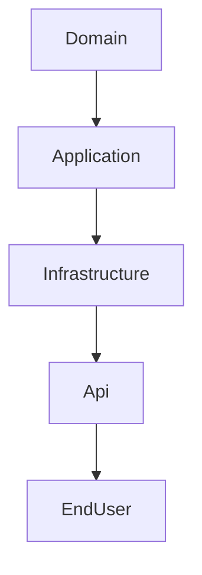
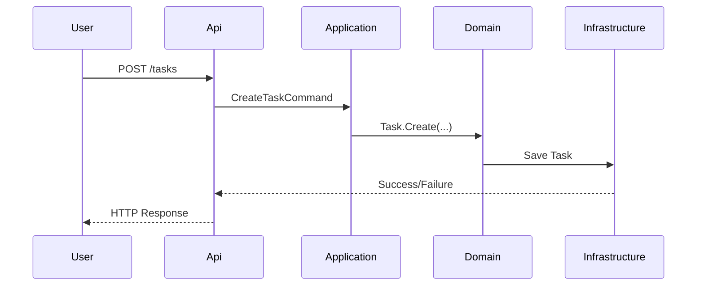

# Sample Solution Architecture

## 1. Overview

This solution demonstrates Clean Architecture and Domain-Driven Design (DDD) for a .NET 9 workshop. It is organized to maximize maintainability, testability, and separation of concerns.

## 2. Solution Structure

```
src/
  [Project].Domain/
  [Project].Application/
  [Project].Infrastructure/
  [Project].Api/
tests/
  [Project].UnitTests/
  [Project].IntegrationTests/
docs/
  design/
    architecture.md
```

### Layered Architecture



- **Domain:** Core business logic, entities, value objects, domain events.
- **Application:** Use cases, commands/queries, interfaces (ports).
- **Infrastructure:** Adapters, persistence, external integrations.
- **Api:** Minimal API endpoints, DI setup, request/response mapping.

## 3. Component Details

### Domain Layer

- **Aggregates:**
  - Root objects that encapsulate business invariants and manage the lifecycle of related entities.
  - Created via static factory methods (no public constructors).
  - Example: `Task` aggregate manages task properties and enforces rules like title required, due date in the future.

- **Entities:**
  - Objects with a unique identity (e.g., `Task`, `User`).
  - Lifecycle managed by the aggregate root; no public setters.
  - Equality based on identity, not just property values.

- **Value Objects:**
  - Immutable types representing descriptive aspects (e.g., `TaskId`, `TaskPriority`, `DueDate`).
  - Implement value equality (two value objects are equal if all properties are equal).
  - Used for strongly-typed IDs and domain concepts.
  - Example:
    ```csharp
  public sealed record TaskId(Guid Value);
  public sealed record TaskPriority(string Value);
    ```

- **Domain Events:**
  - Represent significant occurrences within the domain (e.g., `TaskCreated`, `TaskCompleted`, `TaskCancelled`).
  - Raised by aggregates to signal state changes or trigger side effects.
  - Handled within the domain or published to external systems.

- **Strongly-Typed IDs:**
  - Use value objects to represent IDs (e.g., `TaskId`, `UserId`) instead of raw primitives.
  - Improves type safety and expressiveness in the domain model.

### Application Layer
- **Use Cases:** Business operations, orchestrate domain logic (e.g., create, update, complete, or cancel a task).
- **Commands/Queries (CQRS):**
  - **Commands:** Represent intent to change state (e.g., CreateTaskCommand, CompleteTaskCommand, CancelTaskCommand).
  - **Queries:** Represent intent to retrieve data (e.g., GetTaskByIdQuery, ListTasksQuery).
  - Handlers process commands/queries, call domain logic, and return results.
- **Ports:** Interfaces for infrastructure dependencies.

### Infrastructure Layer
- **Adapters:** Implement application ports, e.g., task repositories.
- **Persistence:** EF Core or other DB integrations for tasks.
- **External Integrations:** APIs, messaging, notifications, etc.

### Api Layer
- **Minimal Endpoints:**
  - Use ASP.NET Minimal API for concise endpoint definitions.
  - Map HTTP requests to application commands/queries (CQRS separation).
  - Example:
  ```csharp
  app.MapPost("/tasks", async (CreateTaskRequest req, ITaskService svc) =>
    await svc.CreateTaskAsync(req));
  app.MapGet("/tasks/{id}", async (Guid id, ITaskService svc) =>
    await svc.GetTaskByIdAsync(id));
  app.MapPut("/tasks/{id}/complete", async (Guid id, ITaskService svc) =>
    await svc.CompleteTaskAsync(id));
  app.MapDelete("/tasks/{id}", async (Guid id, ITaskService svc) =>
    await svc.CancelTaskAsync(id));
  ```
- **DI Setup:** Register services and repositories.
- **Error Handling:** Use `ProblemDetails` for consistent responses.

## 4. Key Patterns

- **CQRS (Command Query Responsibility Segregation):**
  - Commands and queries are handled separately for clarity and scalability (e.g., create, complete, cancel, and query tasks).
  - No business logic in API layer; all logic in Application/Domain.
  - Enables clear separation of read/write concerns and easier testing.
- **DDD Modeling:** Aggregates, value objects, strongly-typed IDs (e.g., TaskId, TaskPriority).
- **Dependency Injection:** All services registered via DI.
- **Async/Await:** Used throughout for scalability.
- **Testing:** xUnit for unit/integration tests, FakeItEasy for mocks, Testcontainers for integration.
- **Conventional Commits:** Standardized commit messages for traceability.

## 5. Request Lifecycle Example



## 6. Extensibility & Best Practices


- **Organizing Libraries: Feature vs Function**
  - **Feature-Oriented Organization:**
    - Group code by business feature (e.g., `Order/`, `Customer/`, `Product/`) rather than technical function (e.g., `Services/`, `Repositories/`).
    - Each feature folder contains all relevant domain models, use cases, adapters, and endpoints for that feature.
    - Promotes encapsulation, easier navigation, and supports scaling teams by feature ownership.
    - Example structure:
      ```
      src/
        Sales.Domain/Order/
        Sales.Application/Order/
        Sales.Infrastructure/Order/
        Sales.Api/Order/
      ```
  - **Function-Oriented Organization:**
    - Groups code by technical concern (e.g., all repositories together, all services together).
    - Can lead to cross-cutting dependencies and harder-to-maintain code as the solution grows.
  - **Best Practice:**
    - Prefer feature-oriented organization for Clean Architecture and DDD solutions.
    - Keeps business logic cohesive and boundaries clear.
    - Reduces risk of circular dependencies and makes onboarding easier for new contributors.

## 7. References

- [Copilot Instructions](../WORKSHOP-COPILOT-INSTRUCTIONS.md)
- [Architect Copilot Agent Guide](../../.github/agents/architect.agent.md)
- [Presentation Outline](../presentations/workshop_slide_outline.md)

---

*Edit this document as needed to expand on CQRS, Minimal API, or other architectural details.*
