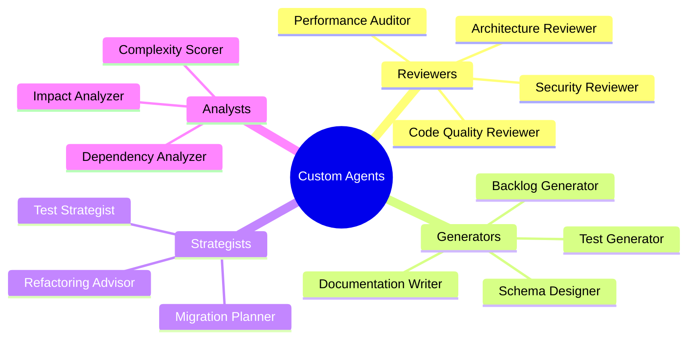

# Custom Agent Architecture

This diagram illustrates the architecture and components of custom GitHub Copilot agents.

## Agent Definition Structure

## Agent Component Hierarchy

## Agent Execution Flow

## Agent Instruction Processing

## Agent Storage and Discovery

## Agent Lifecycle

## Agent Types and Specializations

## Multi-Agent Workflows

## Agent Composition Pattern

## Key Architectural Principles

### 1. **Separation of Concerns**
- Agent definitions are separate from Copilot Instructions
- Each agent has a focused, well-defined role
- No overlap or duplication between agents

### 2. **Composability**
- Agents can be used in sequence
- Outputs from one agent can inform another
- Standard output formats enable chaining

### 3. **Discoverability**
- Agents stored in `.github/agents/`
- Consistent naming: `name.agent.md`
- README provides catalog and usage guide

### 4. **Versioning**
- Agent definitions are version controlled
- Changes tracked through git history
- Breaking changes documented

### 5. **Extensibility**
- Teams can add custom agents
- Agent template provides structure
- No limit to number of agents

---

## See Also

- [Lab 08: Agent Design](../../labs/lab-08-agent-design.md)
- [Agent Design Guide](../../guides/agent-design-guide.md)
- [Agent Governance](../../guides/agent-governance.md)
- [Custom Agent Catalog](../../guides/custom-agent-catalog.md)
