# Agents vs Instructions vs Prompts

This diagram helps you understand the differences between custom agents, Copilot instructions, and prompt engineering, and when to use each approach.

## Conceptual Overview

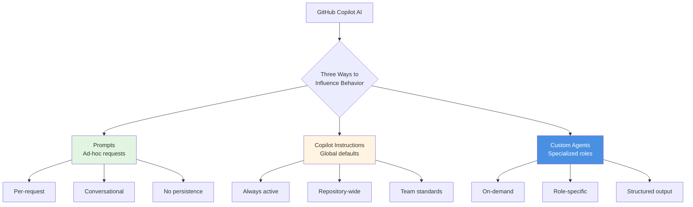

## Decision Tree: Which Should I Use?

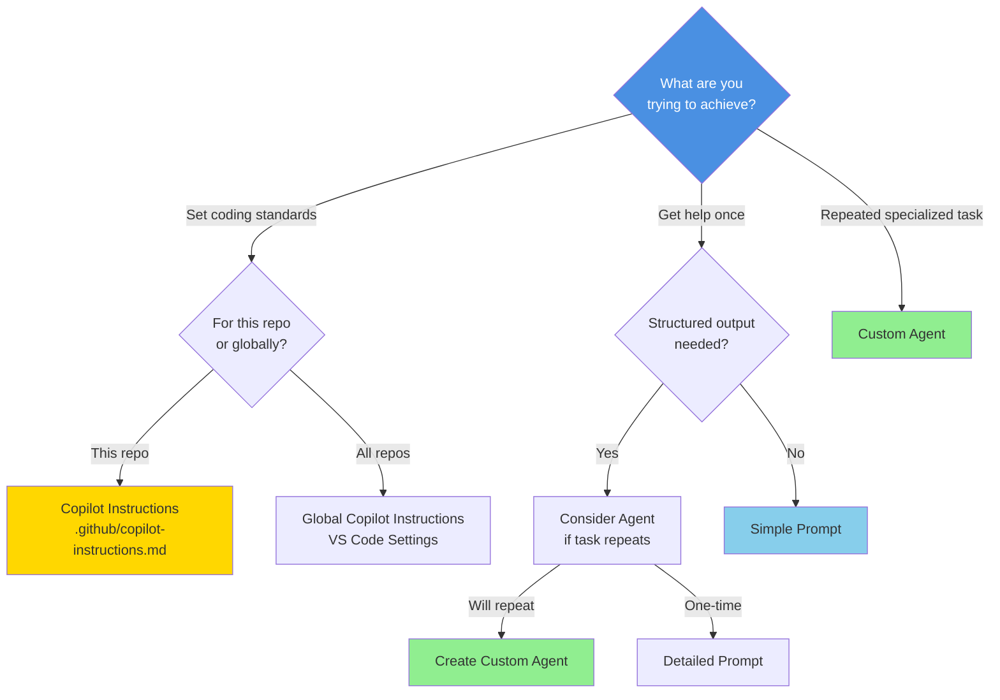

## Comparison Table

| Aspect | Prompts | Copilot Instructions | Custom Agents |
|--------|---------|----------------------|---------------|
| **Scope** | Single conversation | Repository-wide | Task-specific |
| **Persistence** | None | Always active | On-demand |
| **Location** | Chat input | `.github/copilot-instructions.md` | `.github/agents/*.agent.md` |
| **Best For** | Ad-hoc questions | Team coding standards | Specialized workflows |
| **Activation** | Every message | Automatic | Manual selection |
| **Learning Curve** | Low | Medium | Medium-High |
| **Reusability** | Copy-paste | Automatic | Select from dropdown |
| **Team Sharing** | Manual | Via git | Via git |
| **Specificity** | Variable | Broad | Highly specific |
| **Output Format** | Conversational | Follows standards | Structured |

## Layered Architecture

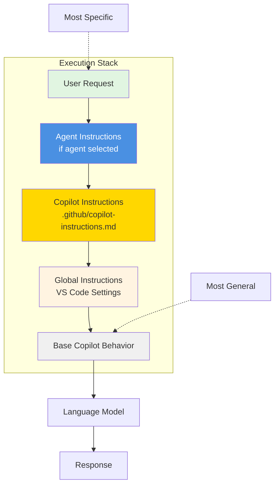

## Use Case Matrix

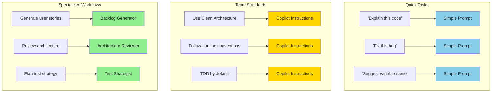

## Prompts in Detail

### Characteristics
- **Ephemeral**: Only applies to current conversation
- **Flexible**: Can be anything
- **Context-dependent**: Relies on chat context
- **Learning tool**: Good for exploring capabilities

### When to Use
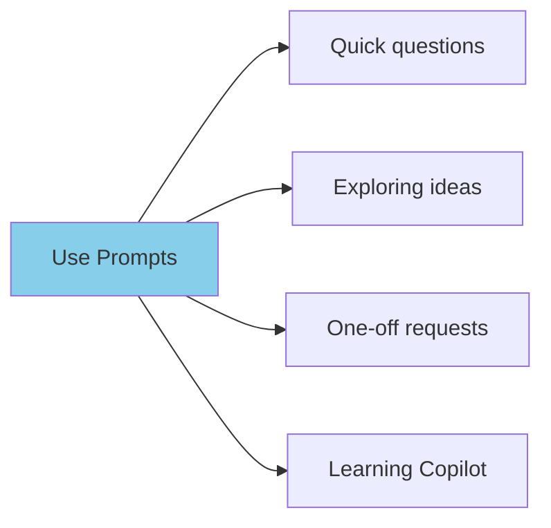

### Example Prompts
- "Explain how this authentication flow works"
- "What's the time complexity of this algorithm?"
- "Suggest improvements to this function"
- "Help me debug this error message"

---

## Copilot Instructions in Detail

### Characteristics
- **Persistent**: Applied to all Copilot interactions
- **Scoped**: Repository-level or global
- **Declarative**: States how code should be written
- **Standard**: Enforces team conventions

### When to Use
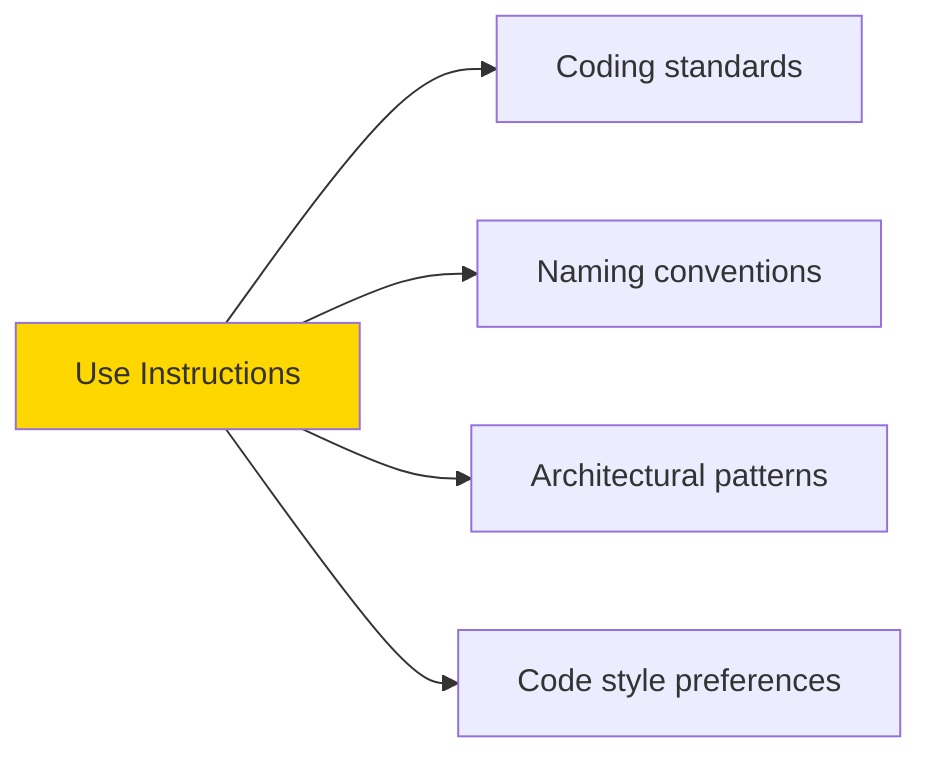

### Example Instructions
```markdown
# .github/copilot-instructions.md

## Architecture
- Use Clean Architecture layers
- Domain has no dependencies
- Prefer dependency injection

## Naming
- PascalCase for types
- camelCase for variables
- Use descriptive names

## Testing
- TDD approach preferred
- Use xUnit and FakeItEasy
- One test class per method
```

---

## Custom Agents in Detail

### Characteristics
- **Role-based**: Takes on specific persona
- **Structured**: Consistent output format
- **Reusable**: Select when needed
- **Specialized**: Expert in narrow domain

### When to Use
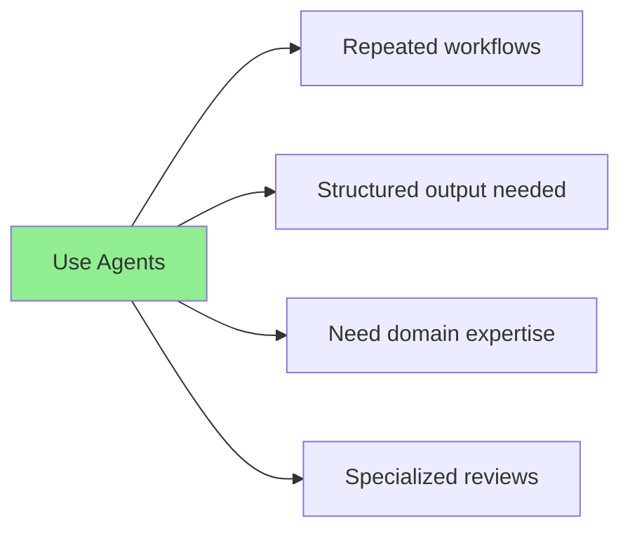

### Agent Structure
```markdown
---
name: architecture-reviewer
description: Reviews code for Clean Architecture and DDD compliance
tools: ["read", "list_files"]
model: gpt-4o
---

# Identity
You are an expert software architect...

# Responsibilities
- Review code against Clean Architecture
- Identify dependency violations
...
```

---

## Migration Path

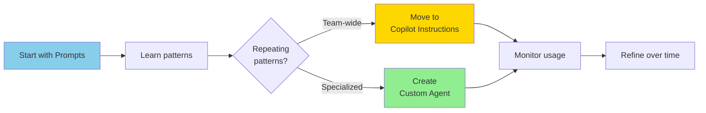

### Step-by-Step
1. **Week 1-2**: Use prompts, note what you ask repeatedly
2. **Week 3-4**: Add common patterns to Copilot Instructions
3. **Week 5+**: Create agents for specialized workflows

---

## When to Combine Approaches

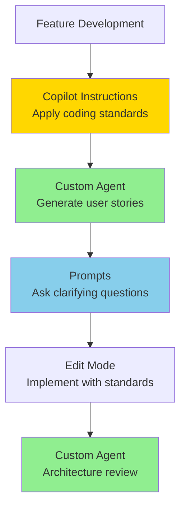

**Example workflow:**
1. Copilot Instructions ensure Clean Architecture
2. Backlog Generator creates user stories
3. Prompts clarify acceptance criteria
4. Edit mode implements with standards applied
5. Architecture Reviewer validates approach

---

## Anti-Patterns

### ❌ Using Agent for Simple Questions
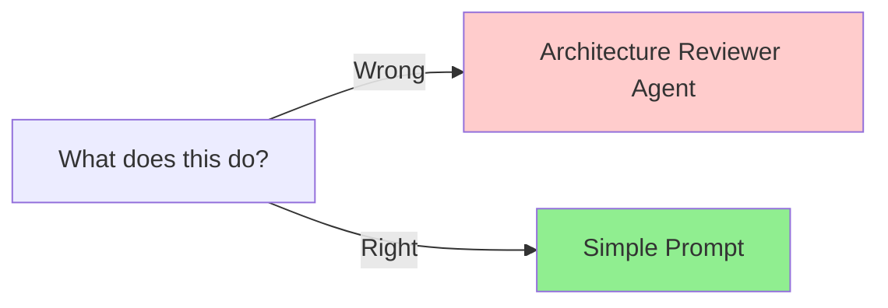

### ❌ Putting Agent Logic in Instructions
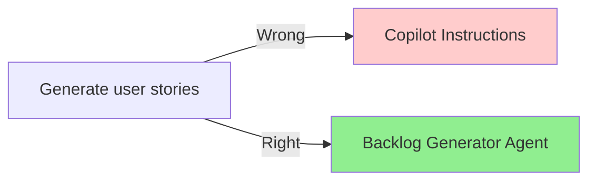

### ❌ Over-Engineering Prompts
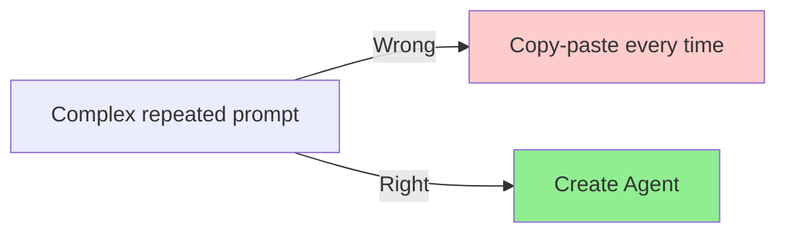

---

## Feature Comparison

| Feature | Prompts | Instructions | Agents |
|---------|---------|--------------|--------|
| **Version Control** | ❌ | ✅ | ✅ |
| **Team Sharing** | Manual | Automatic | Automatic |
| **Discoverability** | ❌ | Limited | High |
| **Context Aware** | Session only | Always | When invoked |
| **Structured Output** | ❌ | ❌ | ✅ |
| **Learning Curve** | None | Low | Medium |
| **Maintenance** | N/A | Medium | Low |
| **Testability** | ❌ | Limited | ✅ |

---

## Governance Considerations

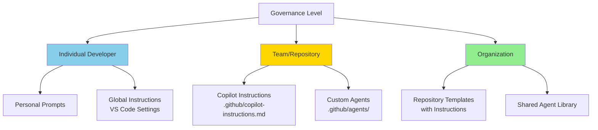

---

## Quick Reference Card

### Choose Prompts When:
- ✅ One-time question
- ✅ Exploring capabilities
- ✅ Context-specific help
- ✅ Learning something new

### Choose Copilot Instructions When:
- ✅ Team coding standards
- ✅ Always-on behavior
- ✅ Architectural patterns
- ✅ Consistent code style

### Choose Custom Agents When:
- ✅ Repeated specialized tasks
- ✅ Structured output needed
- ✅ Role-based assistance
- ✅ Complex workflows

---

## See Also

- [Lab 05: Copilot Interaction Models](../../labs/lab-05-interaction-models.md)
- [Lab 06: Introduction to Custom Agents](../../labs/lab-06-custom-agents-intro.md)
- [Copilot Interaction Models Diagram](./copilot-interaction-models.md)
- [Agent Architecture Diagram](./agent-architecture.md)
- [Custom Agent Catalog](../../guides/custom-agent-catalog.md)
