# Agent Workflow Patterns

This diagram illustrates common patterns for using custom agents in development workflows.

## Pattern 1: Sequential Agent Chain

```mermaid
graph LR
    Start[Feature Request] --> BG[Backlog Generator]
    BG --> Stories[User Stories]
    Stories --> AR[Architecture Reviewer]
    AR --> Design[Design Feedback]
    Design --> TS[Test Strategist]
    TS --> TestPlan[Test Plan]
    TestPlan --> Impl[Implementation]
    
    style BG fill:#e1f5e1
    style AR fill:#fff4e1
    style TS fill:#e1e8ff
    style Impl fill:#d4edda
```

**When to use:**
- Each agent output informs the next step
- Building comprehensive documentation
- Progressive refinement of a concept

**Example scenario:**
1. Generate user stories from requirements
2. Review stories for architectural implications
3. Create test strategy based on design decisions

---

## Pattern 2: Parallel Review

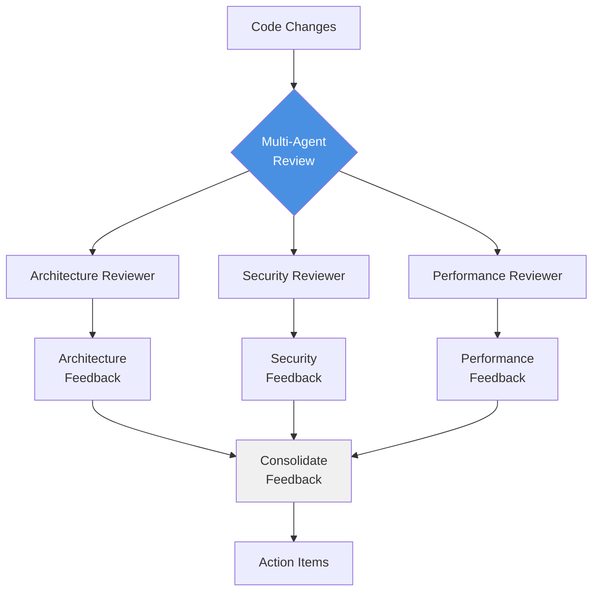

**When to use:**
- Comprehensive code reviews
- Multiple perspectives needed simultaneously
- Different quality dimensions to evaluate

**Example scenario:**
- Before merging a PR, run architecture, security, and performance reviews in parallel
- Gather all feedback before making changes

---

## Pattern 3: Iterative Refinement

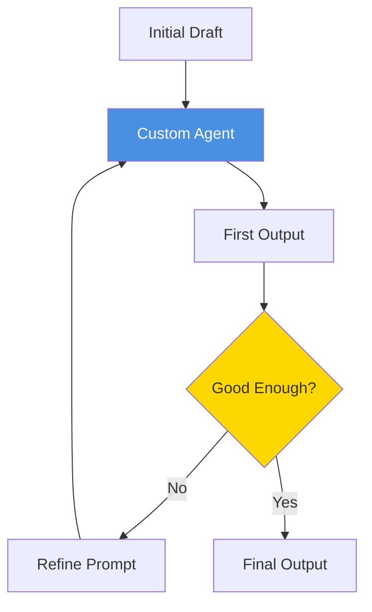

**When to use:**
- Complex outputs requiring multiple iterations
- Learning agent behavior and improving prompts
- Fine-tuning agent instructions

**Example scenario:**
- Generate user stories, review quality, refine acceptance criteria
- Iterate until stories meet INVEST criteria

---

## Pattern 4: Agent-Assisted Development Cycle

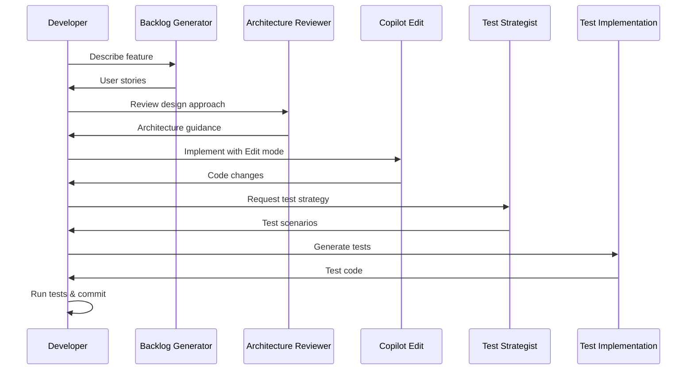

**When to use:**
- Full feature development workflow
- Combining agents with other Copilot modes
- End-to-end guided development

**Example scenario:**
- Use agents for planning and strategy
- Use Edit mode for implementation
- Use Ask mode for quick questions

---

## Pattern 5: Feedback Loop with Validation

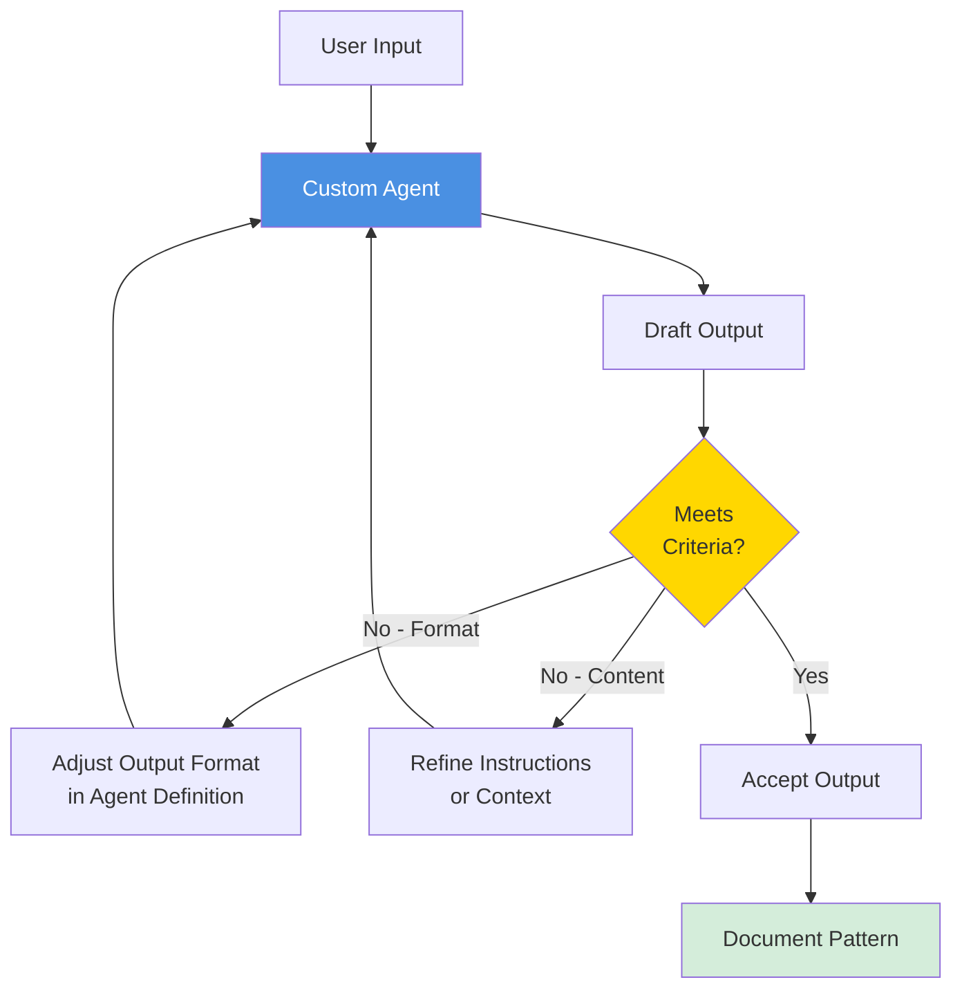

**When to use:**
- Establishing new agents
- Quality assurance for agent outputs
- Building agent definition library

**Example scenario:**
- Create new agent, test with real scenarios
- Refine instructions until output is consistent
- Document successful patterns

---

## Pattern 6: Context-Rich Agent Invocation

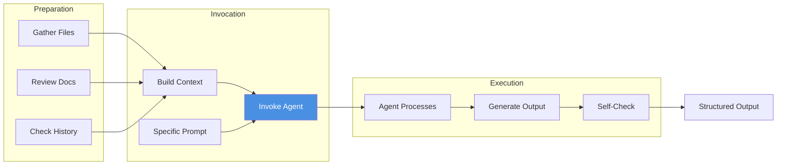

**When to use:**
- Agent needs extensive project context
- Specialized domain knowledge required
- Complex analysis or decisions

**Example scenario:**
- Before architecture review, open relevant design docs
- Include ADRs and architecture diagrams in conversation
- Agent has full context for informed feedback

---

## Pattern 7: Progressive Disclosure

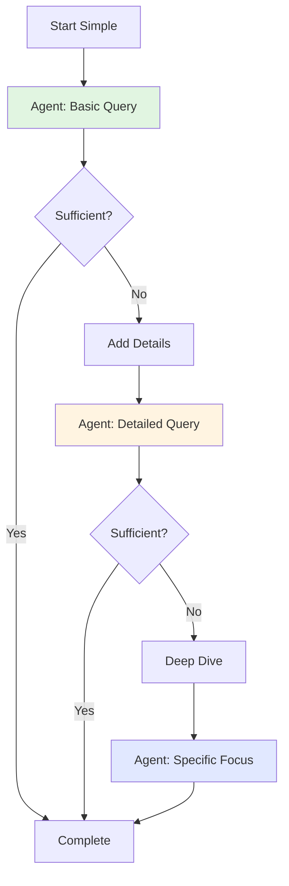

**When to use:**
- Exploring unknown territory
- Learning agent capabilities
- Avoiding information overload

**Example scenario:**
1. Start with high-level architecture review
2. Drill into specific concerns identified
3. Deep dive on critical issues

---

## Pattern 8: Agent Handoff

```mermaid
graph LR
    Dev1[Developer A] --> Agent1[Backlog Generator]
    Agent1 --> Stories[User Stories]
    Stories --> Commit1[Commit Stories]
    
    Commit1 --> Dev2[Developer B]
    Dev2 --> Agent2[Architecture Reviewer]
    Agent2 --> Design[Design Feedback]
    Design --> Commit2[Commit Design]
    
    Commit2 --> Dev3[Developer C]
    Dev3 --> Agent3[Test Strategist]
    Agent3 --> Tests[Test Plan]
    
    style Stories fill:#e1f5e1
    style Design fill:#fff4e1
    style Tests fill:#e1e8ff
```

**When to use:**
- Team collaboration on feature
- Asynchronous workflows
- Different expertise areas

**Example scenario:**
- Product owner generates stories with agent
- Architect reviews with agent, commits feedback
- QA engineer creates test plan with agent

---

## Pattern 9: Multi-Turn Conversation

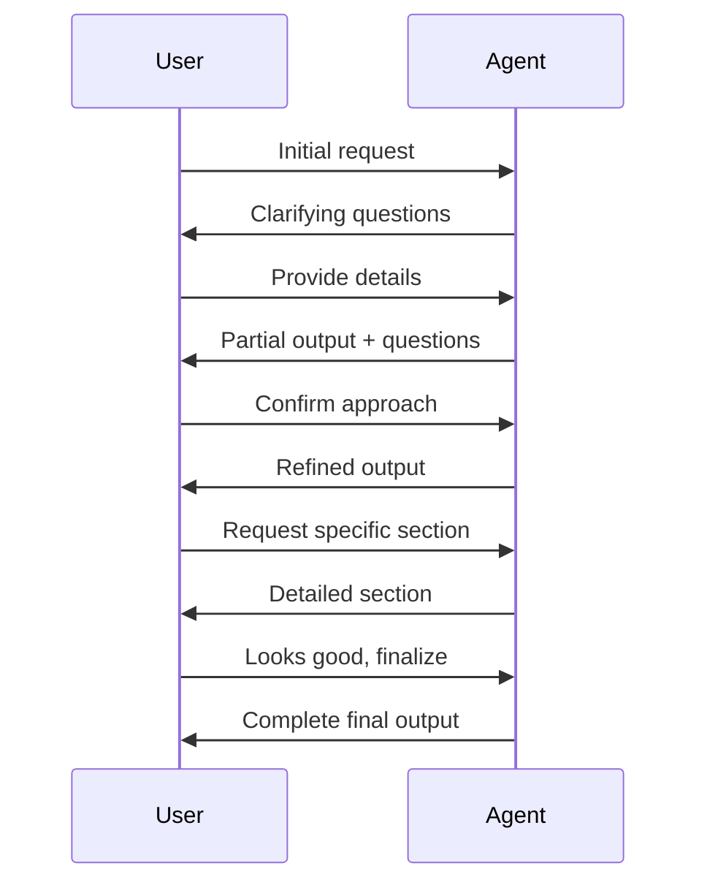

**When to use:**
- Complex requirements needing clarification
- Incremental understanding building
- Collaborative refinement

**Example scenario:**
- Start with vague feature idea
- Agent asks clarifying questions
- Iteratively build complete user stories

---

## Pattern 10: Agent as Second Reviewer

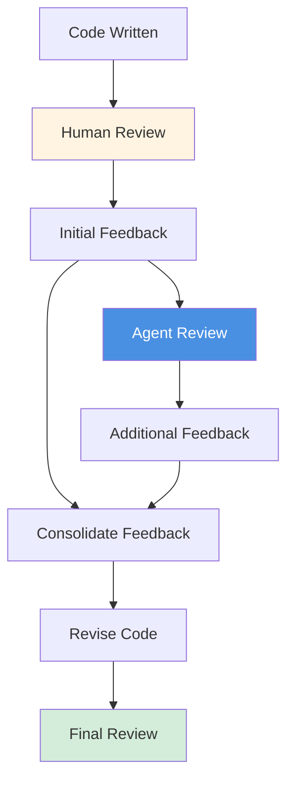

**When to use:**
- Catching issues humans might miss
- Ensuring consistency with standards
- Educational feedback for developers

**Example scenario:**
- Human reviewer focuses on business logic
- Agent checks architectural patterns, naming, structure
- Combined feedback improves code quality

---

## Anti-Patterns to Avoid

### ❌ Agent Overload
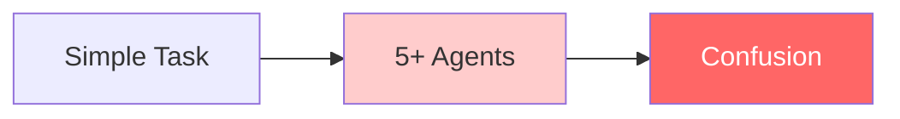

**Problem:** Using too many agents for simple tasks  
**Solution:** Use single agent or standard Copilot for simple requests

---

### ❌ Wrong Mode for Task
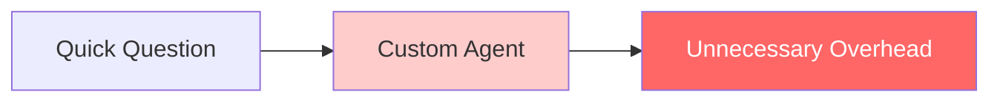

**Problem:** Using agent when Ask mode would suffice  
**Solution:** Use Ask for quick questions, agents for structured analysis

---

### ❌ Insufficient Context
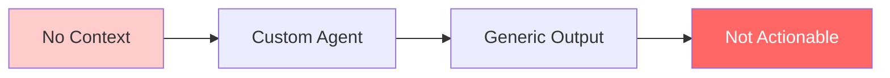

**Problem:** Invoking agent without necessary context  
**Solution:** Provide relevant files, docs, or descriptions

---

## Best Practices Summary

| Pattern | Best For | Avoid For |
|---------|----------|-----------|
| Sequential Chain | Progressive refinement | Simple tasks |
| Parallel Review | Comprehensive analysis | Single concern |
| Iterative Refinement | Complex outputs | Straightforward requests |
| Agent-Assisted Cycle | Full feature development | Bug fixes |
| Feedback Loop | Agent creation | Production use |
| Context-Rich | Complex decisions | Quick questions |
| Progressive Disclosure | Exploration | Known requirements |
| Agent Handoff | Team collaboration | Solo work |
| Multi-Turn | Unclear requirements | Well-defined specs |
| Second Reviewer | Quality assurance | First pass review |

---

## Workflow Decision Tree

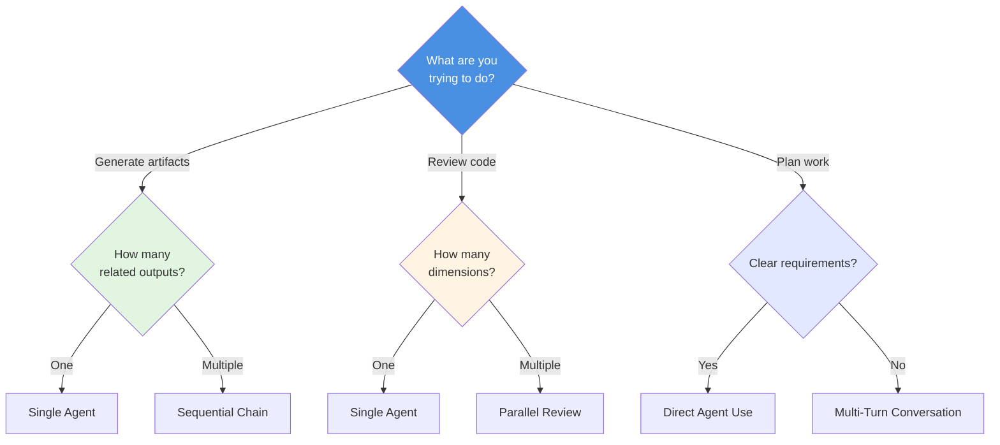

---

## See Also

- [Lab 07: Workflow Agents in Action](../../labs/lab-07-workflow-agents.md)
- [Agent Architecture](./agent-architecture.md)
- [Copilot Interaction Models](./copilot-interaction-models.md)
- [Custom Agent Catalog](../../guides/custom-agent-catalog.md)
