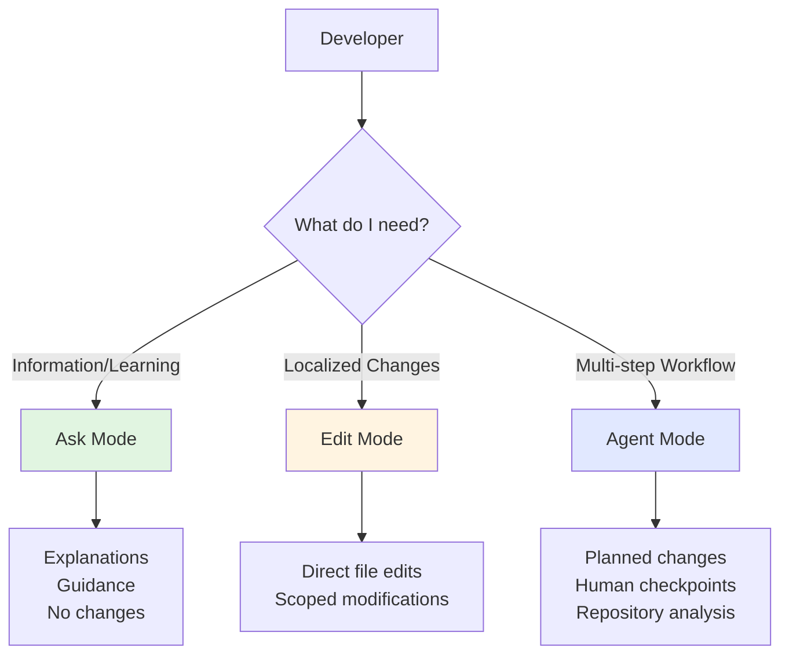
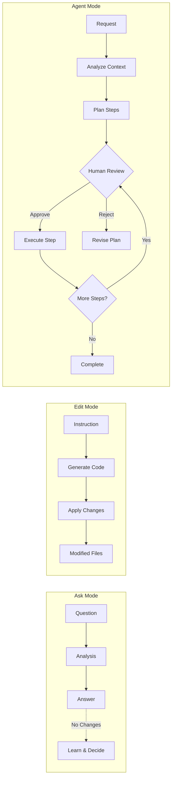
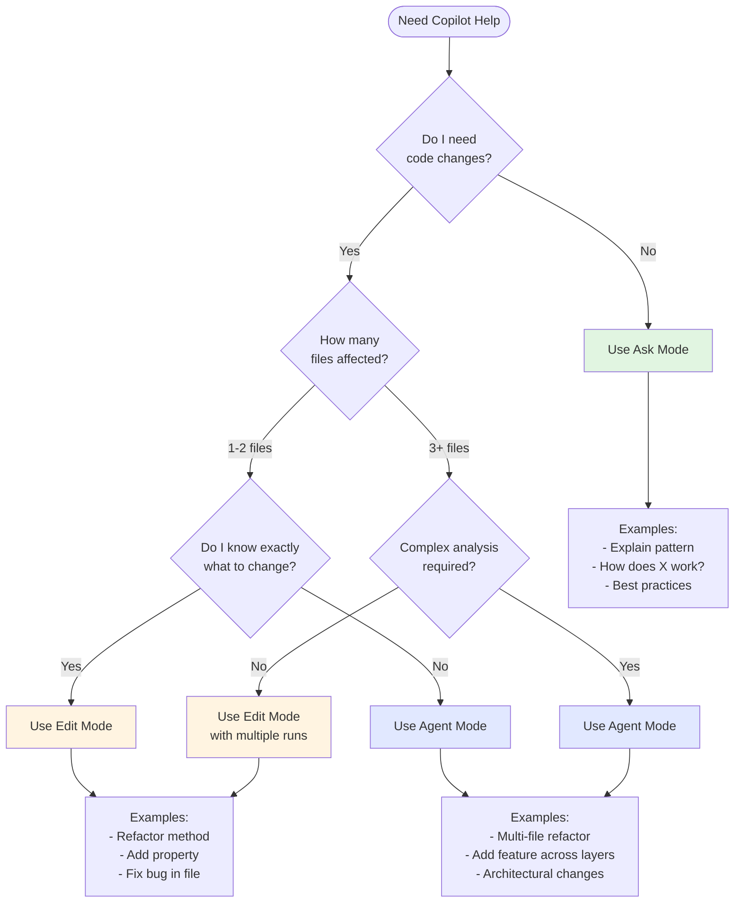
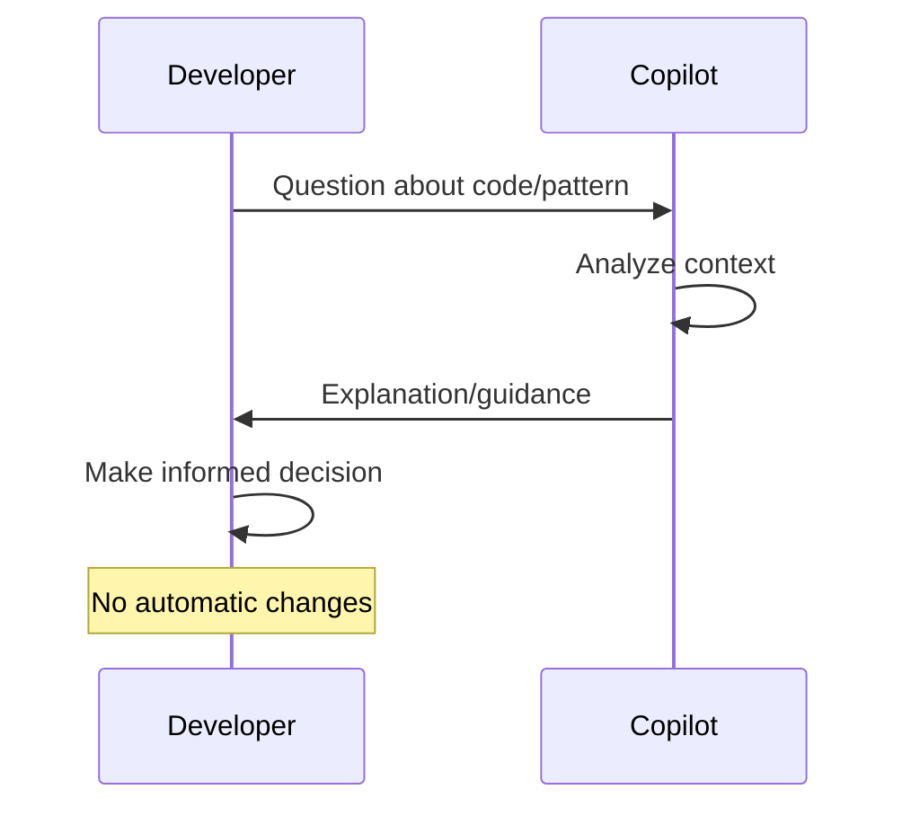
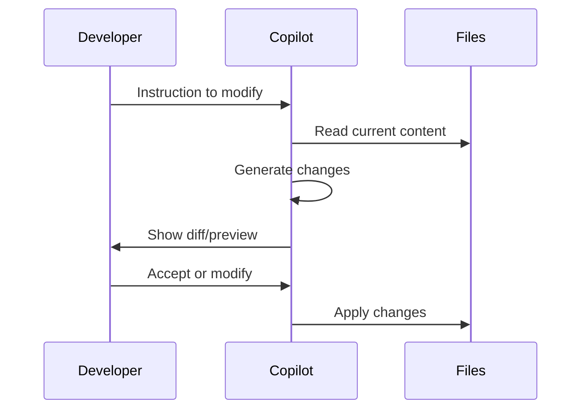
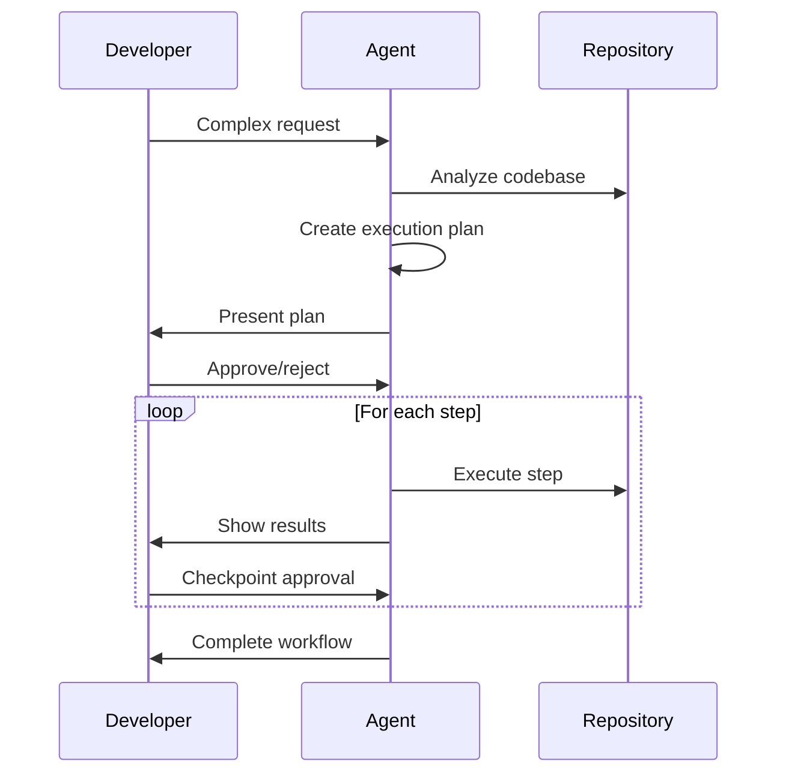

# Copilot Interaction Models

This diagram illustrates the three primary interaction models in GitHub Copilot and when to use each.

## Interaction Models Overview

## Mode Comparison

## Decision Tree: Which Mode to Use?

## Interaction Characteristics

| Characteristic | Ask Mode | Edit Mode | Agent Mode |
|----------------|----------|-----------|------------|
| **Primary Purpose** | Learn & Understand | Modify Code | Complex Workflows |
| **Output Type** | Explanations | Code Changes | Planned Steps + Changes |
| **Scope** | Informational | 1-3 files | Repository-wide |
| **Control Level** | High (no changes) | Medium (review edits) | High (checkpoint approvals) |
| **Speed** | Fastest | Fast | Deliberate |
| **Context Awareness** | Current view | File-focused | Repository-wide |
| **Human Involvement** | Question → Answer | Review → Accept/Reject | Approve each step |
| **Undo Complexity** | N/A | Simple (revert) | Depends on progress |
| **Best For** | Exploration | Targeted fixes | Strategic changes |

## Usage Patterns

### Ask Mode Flow

### Edit Mode Flow

### Agent Mode Flow

## Key Principle

> **Agent Mode is not "better chat"**  
> It's a fundamentally different execution model designed for multi-step, repository-level workflows with human oversight at each critical decision point.

## When Agent Mode Shines

✅ Multi-file refactoring  
✅ Adding features across architectural layers  
✅ Complex analysis requiring repository context  
✅ Workflows needing plan-execute-review cycles  
✅ Changes with dependencies and ordering

## When Agent Mode Is Overkill

❌ Simple file edits  
❌ Quick fixes  
❌ Single-purpose modifications  
❌ Exploratory questions  
❌ Learning or understanding code

---

## See Also

- [Lab 05: Interaction Models](../../labs/lab-05-interaction-models.md)
- [Agent Workflow Patterns](agent-workflow-patterns.md)
- [Agent vs Instructions vs Prompts](agent-vs-instructions-vs-prompts.md)
