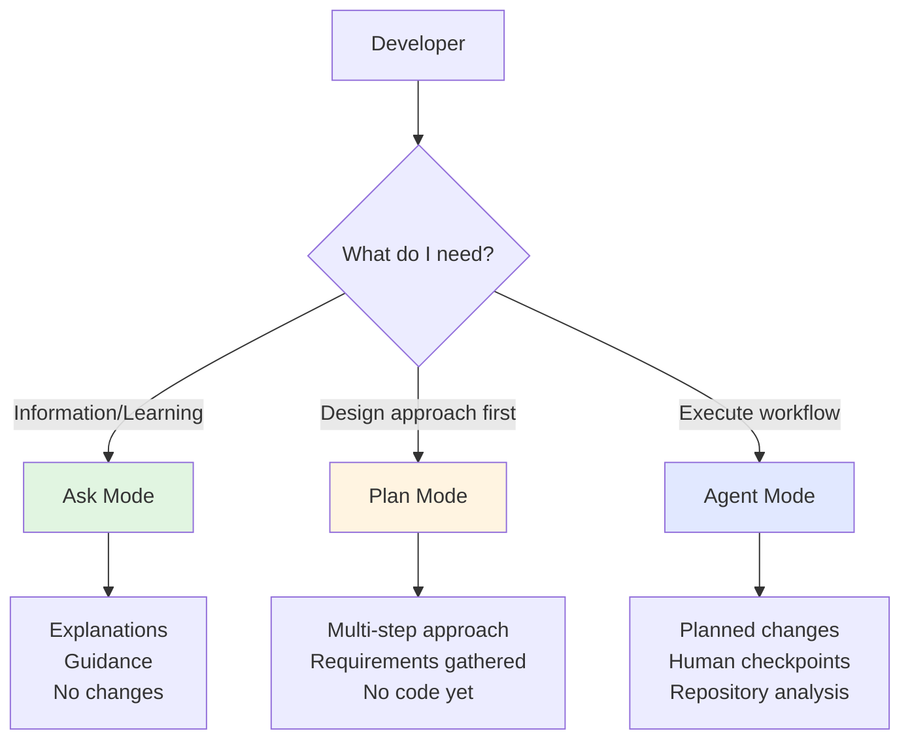
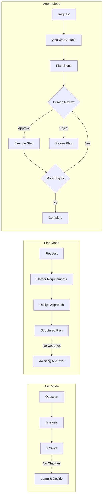
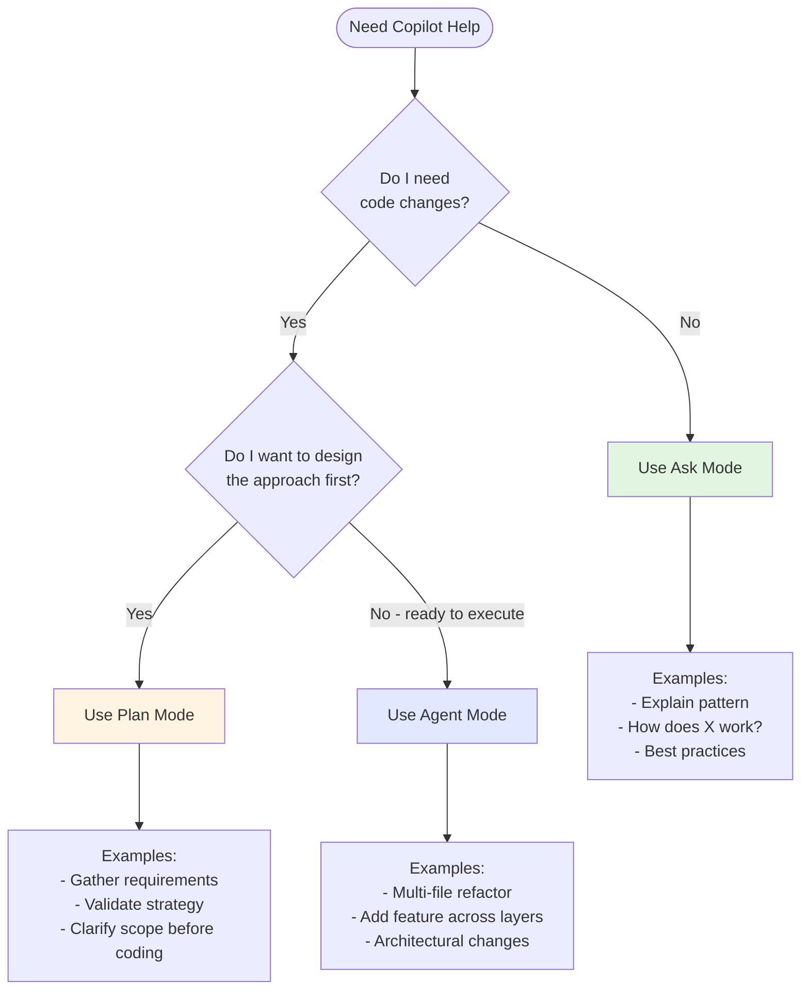
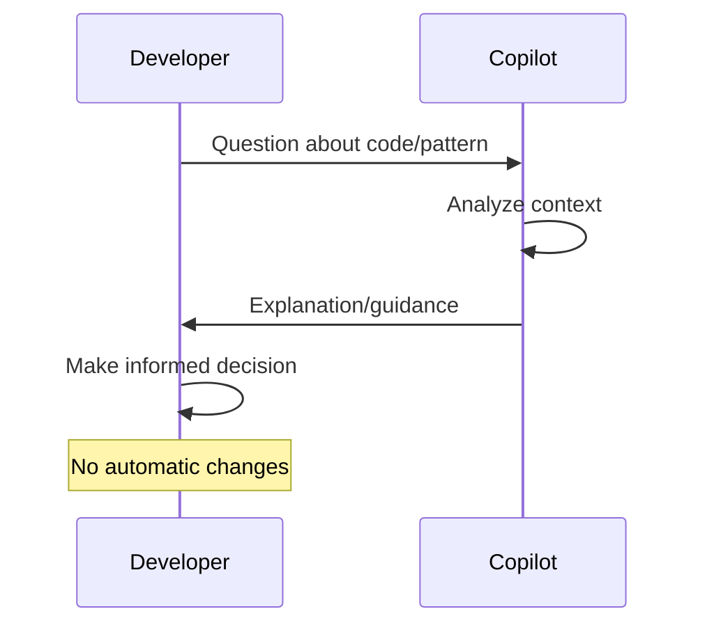
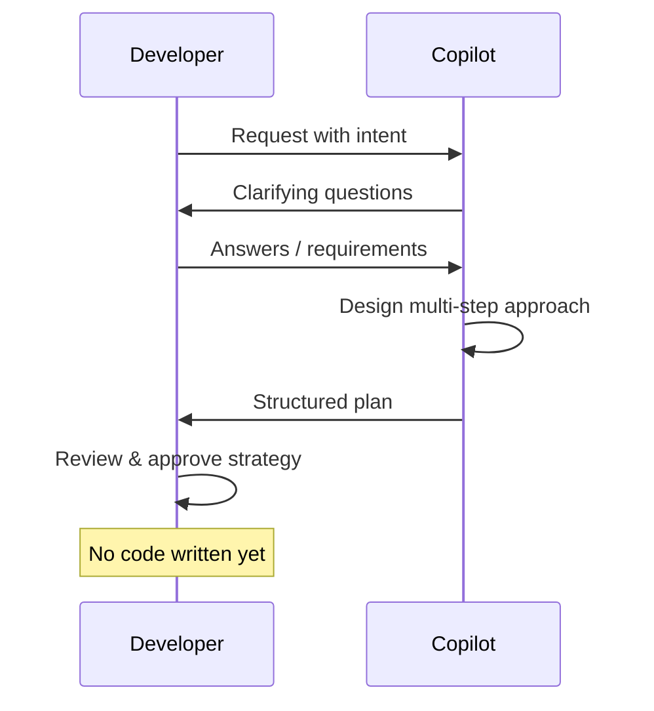
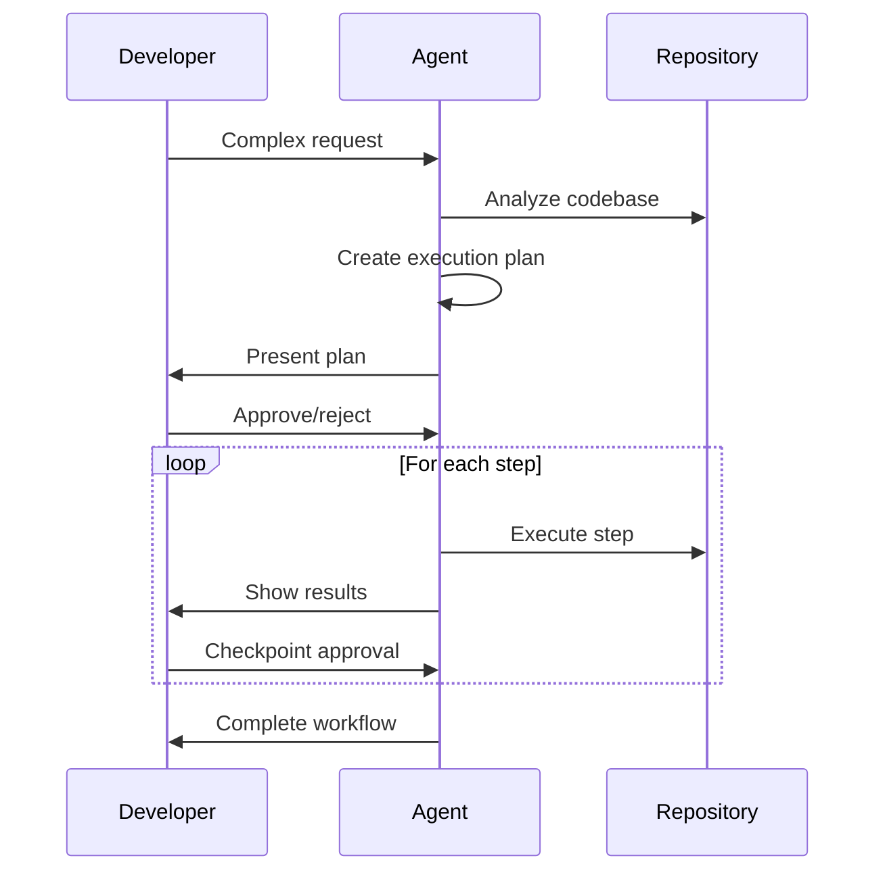

# Copilot Interaction Models

This diagram illustrates the three primary interaction models in GitHub Copilot and when to use each.

## Interaction Models Overview

```mermaid
graph TB
    User[Developer] --> Decision{What do I need?}
    
    Decision -->|Information/Learning| Ask[Ask Mode]
    Decision -->|Design approach first| Plan[Plan Mode]
    Decision -->|Execute workflow| Agent[Agent Mode]
    
    Ask --> AskResult[Explanations<br/>Guidance<br/>No changes]
    Plan --> PlanResult[Multi-step approach<br/>Requirements gathered<br/>No code yet]
    Agent --> AgentResult[Planned changes<br/>Human checkpoints<br/>Repository analysis]
    
    style Ask fill:#e1f5e1
    style Plan fill:#fff4e1
    style Agent fill:#e1e8ff
```

## Mode Comparison

```mermaid
graph LR
    subgraph "Ask Mode"
        A1[Question] --> A2[Analysis]
        A2 --> A3[Answer]
        A3 -.No Changes.-> A4[Learn & Decide]
    end
    
    subgraph "Plan Mode"
        P1[Request] --> P2[Gather Requirements]
        P2 --> P3[Design Approach]
        P3 --> P4[Structured Plan]
        P4 -.No Code Yet.-> P5[Awaiting Approval]
    end
    
    subgraph "Agent Mode"
        G1[Request] --> G2[Analyze Context]
        G2 --> G3[Plan Steps]
        G3 --> G4{Human Review}
        G4 -->|Approve| G5[Execute Step]
        G4 -->|Reject| G6[Revise Plan]
        G5 --> G7{More Steps?}
        G7 -->|Yes| G4
        G7 -->|No| G8[Complete]
    end
```

## Decision Tree: Which Mode to Use?

```mermaid
flowchart TD
    Start([Need Copilot Help]) --> Q1{Do I need<br/>code changes?}
    
    Q1 -->|No| UseAsk[Use Ask Mode]
    Q1 -->|Yes| Q2{Do I want to design<br/>the approach first?}
    
    Q2 -->|Yes| UsePlan[Use Plan Mode]
    Q2 -->|No - ready to execute| UseAgent[Use Agent Mode]
    
    UseAsk --> AskEx[Examples:<br/>- Explain pattern<br/>- How does X work?<br/>- Best practices]
    UsePlan --> PlanEx[Examples:<br/>- Gather requirements<br/>- Validate strategy<br/>- Clarify scope before coding]
    UseAgent --> AgentEx[Examples:<br/>- Multi-file refactor<br/>- Add feature across layers<br/>- Architectural changes]
    
    style UseAsk fill:#e1f5e1
    style UsePlan fill:#fff4e1
    style UseAgent fill:#e1e8ff
```

## Interaction Characteristics

| Characteristic | Ask Mode | Plan Mode | Agent Mode |
|----------------|----------|-----------|------------|
| **Primary Purpose** | Learn & Understand | Design & Clarify | Execute Workflows |
| **Output Type** | Explanations | Structured Plan | Planned Steps + Changes |
| **Code Generated** | None | None (plan only) | Yes, with review |
| **Scope** | Informational | Requirements gathering | Repository-wide |
| **Control Level** | High (no changes) | High (approve plan) | High (checkpoint approvals) |
| **Speed** | Fastest | Fast | Deliberate |
| **Best For** | Exploration | Strategy validation | Implementation |

## Usage Patterns

### Ask Mode Flow

```mermaid
sequenceDiagram
    participant D as Developer
    participant C as Copilot
    
    D->>C: Question about code/pattern
    C->>C: Analyze context
    C->>D: Explanation/guidance
    D->>D: Make informed decision
    Note over D: No automatic changes
```

### Plan Mode Flow

```mermaid
sequenceDiagram
    participant D as Developer
    participant C as Copilot
    
    D->>C: Request with intent
    C->>D: Clarifying questions
    D->>C: Answers / requirements
    C->>C: Design multi-step approach
    C->>D: Structured plan
    D->>D: Review & approve strategy
    Note over D: No code written yet
```

### Agent Mode Flow

```mermaid
sequenceDiagram
    participant D as Developer
    participant A as Agent
    participant R as Repository
    
    D->>A: Complex request
    A->>R: Analyze codebase
    A->>A: Create execution plan
    A->>D: Present plan
    D->>A: Approve/reject
    
    loop For each step
        A->>R: Execute step
        A->>D: Show results
        D->>A: Checkpoint approval
    end
    
    A->>D: Complete workflow
```

## Key Principle

> **Agent Mode is not "better chat"**  
> It's a fundamentally different execution model designed for multi-step, repository-level workflows with human oversight at each critical decision point.

## When Plan Mode Shines

✅ Requirements are unclear and need clarifying before coding  
✅ You want to validate the approach before committing  
✅ Complex feature with multiple design options  
✅ Onboarding — understanding what needs to change before changing it  

## When Agent Mode Shines

✅ Multi-file refactoring  
✅ Adding features across architectural layers  
✅ Complex analysis requiring repository context  
✅ Workflows needing plan-execute-review cycles  
✅ Changes with dependencies and ordering

---

## See Also

- [Lab 05: Interaction Models](../../labs/lab-05-interaction-models.md)
- [Agent Workflow Patterns](agent-workflow-patterns.md)
- [Agent vs Instructions vs Prompts](agent-vs-instructions-vs-prompts.md)
