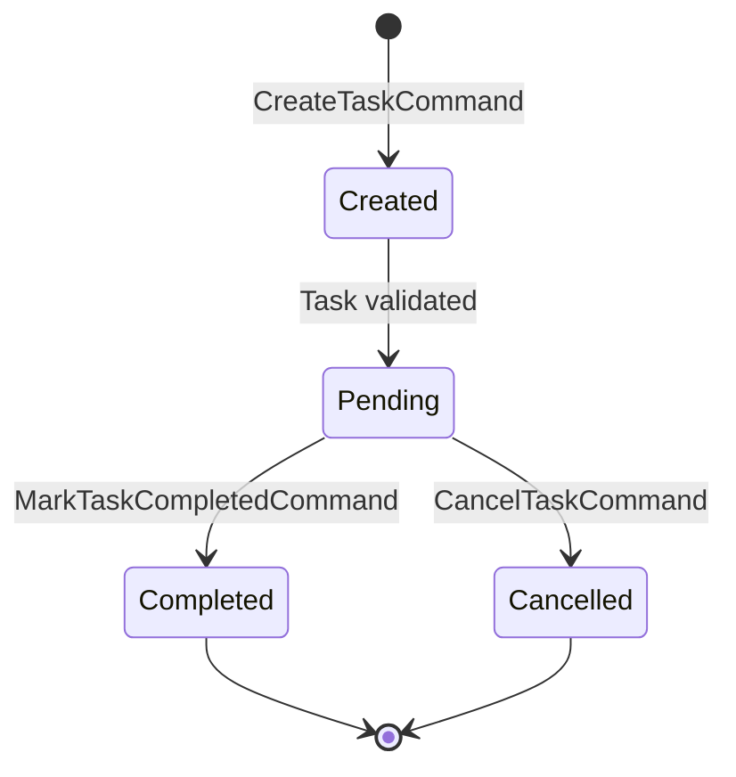

# Task Lifecycle Diagram

This diagram illustrates the lifecycle of a Task in the Task Manager application, from creation to completion, following Clean Architecture and DDD principles.

---

## States
- **Created:** Task is created and validated.
- **Pending:** Task is active and awaiting completion or cancellation.
- **Completed:** Task has been finished.
- **Cancelled:** Task has been cancelled and will not be completed.

## Transitions
- **CreateTaskCommand:** Initiates task creation.
- **MarkTaskCompletedCommand:** Marks a pending task as completed.
- **CancelTaskCommand:** Cancels a pending task.

---

*See also: [Sample Solution Architecture](../architecture.md), [Feature Walkthrough](../../guides/adding-a-new-task-feature.md)*
