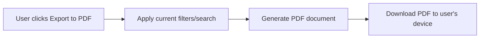

# Requirements Elicitation Primer (Pre-Read for Non-Technical Participants)

**Who this is for**:
Business analysts, product owners, subject matter experts, project sponsors, and anyone attending the workshop who doesn't write code day-to-day.

**Why read this first**:
Throughout this workshop, developers will use GitHub Copilot to turn requirements into working software. You don't need to write a line of code to contribute — but understanding *how* Copilot elicits, clarifies, and documents requirements will help you participate actively, ask better questions, and get more value out of the sessions. Read this before Day 1.

**Time to read**: ~10 minutes

---

## 1. What Is GitHub Copilot, in Plain Terms?

GitHub Copilot is an AI assistant that works alongside developers inside their coding tools. Think of it less like "autocomplete" and more like a **knowledgeable teammate you can chat with in plain English**. You describe what you want in everyday language, and Copilot:

- Asks clarifying questions when something is vague
- Turns a rough idea into structured requirements or user stories
- Suggests edge cases and risks a team might overlook
- Drafts documentation, diagrams, and even code based on what was discussed

You don't need any technical background to have this kind of conversation with Copilot — it's designed to meet you where you are.

## 2. Why Requirements Quality Matters More Than Ever

AI coding assistants are good at building *something* fast. But they'll build the **wrong** thing just as fast if the requirements are vague or incomplete. That raises the value of classic BA/PO skills: asking good questions, spotting ambiguity, defining "done." This workshop treats requirements elicitation as a first-class skill, not an afterthought.

## 3. Benefits of Using Copilot for Requirements Work

Beyond speed, Copilot brings a few specific advantages worth knowing before the workshop:

- **It can understand existing code.** Copilot can read the actual codebase — the domain model, existing features, API contracts — and use that as context. It can flag when a new requirement conflicts with how the system already works. It can point out related functionality that already exists. It grounds new requirements in reality, not assumptions.
- **It can write requirements directly into your team's tools.** Copilot can draft issues, epics, or backlog items in a structure ready to paste into **Jira** or **Azure DevOps** — titles, descriptions, acceptance criteria, labels/tags. This cuts the manual re-typing that normally happens between "we decided this in a meeting" and "it's a ticket in the backlog."
- **It can reference your source documents.** Point Copilot at meeting transcripts, requirements documents, emails, design docs, or notes. Ask it to extract and organize the requirements buried inside them. This is especially useful for turning messy input — a 45-minute meeting transcript, a chain of Slack/Teams messages — into a clean, structured requirements document, while preserving traceability back to where each requirement came from.

Copilot isn't just answering questions in a vacuum. It works with the same code, tickets, and documents your team already relies on.

## 4. How Copilot Elicits Requirements

In this workshop, requirements gathering with Copilot generally follows four phases:

1. **Discovery** — Copilot reviews any notes, tickets, transcripts, or existing documentation you provide, to build context before asking questions.
2. **Analysis** — It separates what's explicitly stated from what's implied, and groups findings into categories like functional needs, business rules, and constraints.
3. **Clarification** — It asks targeted, one-at-a-time questions about anything ambiguous, rather than overwhelming you with a long list at once.
4. **Documentation** — It produces structured, readable documents: requirements specs, user stories with acceptance criteria, and diagrams showing how a process flows.

This mirrors how an experienced business analyst would work — the difference is speed and consistency.

## 5. Meet "Ellie": A Requirements-Focused Copilot Agent

This workshop includes a specialized Copilot configuration named **Ellie**, built specifically to act as a Business Analyst. When facilitators or participants ask Copilot to work in "Ellie mode," it will:

- Ask one clarifying question at a time, in plain business language (not technical jargon)
- Confirm its understanding before moving forward
- Call out assumptions and open questions explicitly, so nothing gets silently guessed
- Produce organized markdown documents — requirements, user stories, and diagrams — that anyone can read, not just developers

**What Ellie deliberately won't do**: make architecture/design decisions, write code, approve requirements, estimate effort, or commit to timelines. Those stay with your team, exactly as they would today.

## 6. A Sample Conversation

Here's a simplified example of a working session:

> **You**: "Users want to export their task list to PDF."
>
> **Copilot/Ellie**: "Should the PDF include all task details, or just a summary? Are there formatting or branding requirements? Should this work on filtered or searched lists too?"
>
> *(After you answer)* Copilot drafts a requirements document with functional requirements (e.g., "user can export the current task list to PDF"), non-functional requirements (e.g., "export completes within 5 seconds"), acceptance criteria, and a simple diagram showing the export flow.

Notice that the questions are business questions, not technical ones. This is the kind of exchange you can expect to observe — and participate in — during the workshop.

## 7. Example: Structured Output from Ellie

Once questions are answered, Ellie doesn't just summarize in chat. It produces a real markdown document your team can save, share, and paste into Jira or Azure DevOps. Continuing the PDF export example, the output looks like this:

````markdown
# PDF Export Requirements

## Overview
Allow users to export their current task list to a PDF file for sharing or offline
reference, without leaving the Task Manager application.

## Functional Requirements
### FR-001: Export Current Task List to PDF
**Priority**: High
**Description**: User can trigger a PDF export of their currently visible task list
(respecting any active filters or search terms).
**Acceptance Criteria**:
- A visible "Export to PDF" action is available from the task list view
- The exported PDF reflects only the tasks currently visible (filtered/searched)
- The PDF includes task title, priority, due date, and status for each task

### FR-002: Include Summary Header
**Priority**: Medium
**Description**: Exported PDF includes a header summarizing export date and applied filters.
**Acceptance Criteria**:
- Header shows the export date/time
- Header lists any active filters (e.g., "Priority: High", "Status: Open")

## Non-Functional Requirements
### NFR-001: Performance
Export completes within 5 seconds for lists of up to 500 tasks.

## Business Rules
- Only tasks visible to the current user's permissions may be included in the export.

## Diagrams


## Open Questions
- Should branding/logo be included on the exported PDF?
- Is there a maximum task count per export?

## Assumptions
- Export is client-triggered and does not need to be scheduled or emailed.

## Risks
- Very large task lists may need pagination or a background export process.
````

A few things to notice about this output:

- **It's immediately usable.** FR-001 and FR-002 already match Jira/Azure DevOps ticket format: title, priority, description, acceptance criteria. Copy them into a new issue with minimal rework.
- **Nothing is hidden.** Open questions, assumptions, and risks are called out explicitly instead of silently resolved. Your team can review and confirm them before work begins.
- **It includes a visual.** The Mermaid diagram renders as an actual flowchart in most markdown viewers, including GitHub. Stakeholders get a quick visual of the process without a separate diagramming tool.
- **It's both human- and agent-readable.** The same plain markdown file a stakeholder reads and reviews is also structured well enough for Copilot to read back in later — for example, when a developer asks Copilot to generate backlog items, test cases, or code from this exact document. Nothing gets re-typed or reformatted going from "requirements" to "development input"; the document serves both audiences as-is.

## 8. Try It Yourself (Optional, No Coding Required)

If you have access to GitHub Copilot Chat before the workshop (in VS.com, GitHub.com, or the mobile app), you can try this hands-on:

1. Open a Copilot Chat conversation.
2. Describe a vague idea for a feature, in one or two sentences — something from your own work is great, or use: *"Users want to be reminded before a task's due date."*
3. Ask: *"Can you help me turn this into a clear set of requirements? Ask me clarifying questions first."*
4. Answer the questions Copilot asks, one at a time.
5. Ask Copilot to summarize the requirements and acceptance criteria it gathered.

There's no wrong way to do this. The goal is to experience the question-and-answer rhythm before you see it used live in the workshop.

## 9. What to Expect During the Workshop

- Developers will use these same elicitation patterns as the starting point for hands-on labs (turning a user story into backlog items, acceptance criteria, and working code).
- You may be asked to play the role of "product owner" or "stakeholder" and answer Copilot's clarifying questions in a lab exercise.
- Facilitators will show how vague requirements can lead AI-assisted development astray — and how good elicitation habits prevent that.
- You're encouraged to ask "why did it ask that?" or "what would happen if we hadn't clarified that?" at any point — these questions drive some of the best discussions.

## 10. Key Terms You'll Hear

| Term | Plain-language meaning |
|---|---|
| **Prompt** | The instruction or question you type to Copilot. |
| **User story** | A short description of a feature from the user's point of view (e.g., "As a user, I want to... so that..."). |
| **Acceptance criteria** | The specific, testable conditions that must be true for a feature to be considered complete. |
| **Backlog item** | A discrete, actionable piece of work broken out from a larger requirement. |
| **Agent** | A specially configured version of Copilot set up for a particular role or task (like Ellie, the BA agent). |
| **Diagram (Mermaid)** | A simple text-based way to generate flowcharts/diagrams that Copilot can create automatically from a conversation. |

## 11. Questions to Bring With You

Come prepared to ask:
- How do we make sure Copilot's assumptions match what stakeholders actually meant?
- Who reviews and approves AI-drafted requirements before development starts?
- How does this change (or not change) our existing intake/backlog process?

---

*Next step: proceed to the [Lab Walkthroughs](../labs/README.md) index for the full workshop schedule, or ask a facilitator where the requirements-elicitation exercises fit into your track.*
