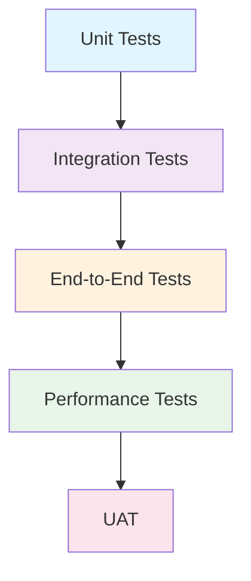

# Bonus Lab: Test Planning from Work Items with GitHub Copilot

**Target Audience:** Test Engineers, QA Engineers, SDET  
**Duration:** 20-30 minutes  
**Difficulty:** Intermediate

## Objectives

By the end of this lab, you will:
- Extract testable requirements from GitHub issues using Copilot
- Generate comprehensive test scenarios covering multiple testing levels
- Create detailed test plans with acceptance criteria validation
- Identify test data requirements and edge cases
- Produce test documentation ready for execution

---

## Prerequisites

- Access to GitHub Copilot in VS Code
- Familiarity with testing concepts (unit, integration, end-to-end)
- Basic understanding of software development lifecycle
- Completed at least Lab 1 or Lab 4 (helpful but not required)

---

## Scenario

Your team is working on **GitHub Issue #12**: Upgrading the Task Manager repository from an in-memory implementation to Azure Cosmos DB for production persistence.

As a test engineer, you need to create a comprehensive test plan that ensures:
- ✅ All existing functionality continues to work
- ✅ New database integration is properly tested
- ✅ Error scenarios are handled gracefully
- ✅ Performance meets requirements
- ✅ Data migration is safe and reliable

---

## Part 1: Understanding the Requirement (5 minutes)

### Exercise 1.1: Extract Testable Requirements

Instead of manually reading through the issue, use Copilot to extract testable requirements.

**In Copilot Chat:**

```
@workspace Review the documentation for Issue #12 (Cosmos DB upgrade) and extract all testable requirements. Organize them by:
- Functional requirements
- Non-functional requirements
- Data requirements
- Error handling requirements
```

**Expected Output:**

```markdown
## Testable Requirements from Issue #12

### Functional Requirements
1. All existing CRUD operations must continue to work
   - Create task with priority and due date
   - Retrieve task by ID
   - Retrieve all tasks with optional filtering
   - Update task properties
   - Delete task

2. Data must persist across application restarts
   - Tasks created in one session are available in next session
   - No data loss during normal operation

3. Repository interface contract must remain unchanged
   - ITaskRepository interface behavior preserved
   - Existing application layer code requires no changes

### Non-Functional Requirements
1. Response time: <100ms for CRUD operations (95th percentile)
2. Concurrent operations: Support at least 100 concurrent requests
3. Data consistency: Strong consistency for writes
4. Availability: 99.9% uptime during operation

### Data Requirements
1. Task ID must be globally unique (GUID/UUID)
2. Timestamps must use UTC
3. Priority values must be validated enum
4. Due dates must support nullable values

### Error Handling Requirements
1. Connection failures handled gracefully
2. Duplicate ID creation prevented
3. Not found scenarios return appropriate errors
4. Transient errors retry with exponential backoff
5. Configuration errors detected at startup
```

### Exercise 1.2: Identify Risk Areas

**Ask Copilot:**

```
Based on the Cosmos DB repository upgrade in Issue #12, what are the highest risk areas that need thorough testing? Prioritize by potential impact.
```

**Expected Response:**

```markdown
## High-Risk Areas for Testing (Priority Order)

### 1. Data Persistence (CRITICAL)
**Risk:** Data loss or corruption
**Impact:** Production data permanently lost
**Testing Focus:**
- Verify writes are committed before success response
- Test application restart doesn't lose data
- Validate data integrity after operations

### 2. Connection Management (HIGH)
**Risk:** Connection leaks or failures
**Impact:** Application becomes unavailable
**Testing Focus:**
- Connection pooling works correctly
- Failed connections are retried
- Timeouts handled appropriately
- Resource cleanup on errors

### 3. Error Handling (HIGH)
**Risk:** Unhandled exceptions crash application
**Impact:** Service outages, poor user experience
**Testing Focus:**
- Network failures
- Throttling/rate limiting
- Invalid configurations
- Database unavailable scenarios

### 4. Performance Regression (MEDIUM)
**Risk:** New implementation slower than in-memory
**Impact:** User experience degradation
**Testing Focus:**
- CRUD operation latency
- Concurrent request handling
- Query performance under load

### 5. Configuration Issues (MEDIUM)
**Risk:** Deployment failures in different environments
**Impact:** Cannot deploy to production
**Testing Focus:**
- Environment-specific configurations
- Missing/invalid connection strings
- Permission issues
```

---

## Part 2: Generate Test Scenarios (8 minutes)

### Exercise 2.1: Create Test Scenario Matrix

**Prompt Copilot:**

```
Create a test scenario matrix for the Cosmos DB repository implementation covering:
- Happy path scenarios
- Edge cases
- Error scenarios
- Performance scenarios
Organize by test level: Unit, Integration, End-to-End
```

**Expected Output:**

```markdown
## Test Scenario Matrix - Cosmos DB Repository

### Unit Tests (Isolated Component Testing)

| Scenario ID | Test Scenario | Input | Expected Output | Test Type |
|-------------|---------------|-------|-----------------|-----------|
| UT-001 | Create task with valid data | Valid CreateTaskRequest | Task created with ID | Happy Path |
| UT-002 | Create task with null request | null | ArgumentNullException | Error |
| UT-003 | Create task with empty title | Title = "" | ArgumentException | Validation |
| UT-004 | Create task with invalid priority | Priority = "INVALID" | ArgumentException | Validation |
| UT-005 | Create task with past due date | DueDate = yesterday | ArgumentException | Business Rule |
| UT-006 | Get task by valid ID | Existing task ID | Task entity | Happy Path |
| UT-007 | Get task by non-existent ID | Random GUID | null or NotFoundException | Edge Case |
| UT-008 | Update task with valid data | Valid update request | Updated task | Happy Path |
| UT-009 | Update non-existent task | Invalid ID + data | NotFoundException | Error |
| UT-010 | Delete existing task | Valid task ID | Success | Happy Path |
| UT-011 | Delete non-existent task | Invalid task ID | NotFoundException | Error |
| UT-012 | List all tasks when empty | No parameters | Empty collection | Edge Case |
| UT-013 | List all tasks with data | No parameters | Task collection | Happy Path |

### Integration Tests (Database Integration)

| Scenario ID | Test Scenario | Pre-conditions | Expected Behavior | Test Type |
|-------------|---------------|----------------|-------------------|-----------|
| IT-001 | Create and retrieve task | Empty database | Task persisted and retrievable | Happy Path |
| IT-002 | Update persisted task | Task exists in DB | Changes persisted | Happy Path |
| IT-003 | Delete persisted task | Task exists in DB | Task removed, subsequent get fails | Happy Path |
| IT-004 | Connection string invalid | Wrong connection string | Clear error at startup | Configuration |
| IT-005 | Database unreachable | Network/DB down | Appropriate exception with retry | Error Handling |
| IT-006 | Concurrent creates | 10 simultaneous creates | All succeed with unique IDs | Concurrency |
| IT-007 | Concurrent updates same task | 5 updates to same task | Last write wins or conflict detected | Concurrency |
| IT-008 | Transaction rollback | Exception during save | No partial data written | Data Integrity |
| IT-009 | Large payload | Task with max field sizes | Successfully persisted | Edge Case |
| IT-010 | Query with filters | Multiple tasks in DB | Correct subset returned | Query Logic |
| IT-011 | Pagination | 1000 tasks in DB | Paginated results work | Performance |
| IT-012 | Connection pool exhaustion | Exceed connection limit | Waits or fails gracefully | Resource Mgmt |

### End-to-End Tests (API → Database)

| Scenario ID | Test Scenario | API Request | Database State | Expected Response | Test Type |
|-------------|---------------|-------------|----------------|-------------------|-----------|
| E2E-001 | Full CRUD cycle | POST, GET, PUT, DELETE | Clean DB → Task exists → Modified → Deleted | All 2xx responses | Happy Path |
| E2E-002 | Application restart persistence | POST task, restart app, GET task | Task persisted | Same task returned | Data Persistence |
| E2E-003 | Filtered queries | Create 10 tasks, query with filters | 10 tasks in DB | Correct subset | Query Integration |
| E2E-004 | Error propagation | POST invalid data | No DB write | 400 Bad Request | Error Handling |
| E2E-005 | Performance under load | 100 concurrent requests | Empty → 100 tasks | <100ms p95 response time | Performance |

### Performance Tests

| Scenario ID | Test Scenario | Load Pattern | Success Criteria | Test Type |
|-------------|---------------|--------------|------------------|-----------|
| PT-001 | Single operation latency | 1 request/sec for 60s | p95 < 100ms, p99 < 200ms | Baseline |
| PT-002 | Sustained load | 50 req/sec for 5 min | p95 < 150ms, no errors | Load |
| PT-003 | Spike load | 0 → 200 req/sec → 0 | No failures, recovery < 10s | Stress |
| PT-004 | Large dataset queries | Query with 10k tasks | Query < 500ms | Scale |
| PT-005 | Connection pool efficiency | 100 concurrent connections | No connection errors | Resource |
```

### Exercise 2.2: Generate Specific Test Cases

For critical scenarios, generate detailed test cases.

**Prompt:**

```
Generate detailed test cases for scenario IT-005 (database unreachable) including:
- Pre-conditions
- Test steps
- Expected results
- Pass/fail criteria
Format as a test case specification
```

**Expected Output:**

```markdown
## Test Case Specification: IT-005

### Test Case ID: IT-005
**Title:** Database Unreachable - Error Handling and Retry Logic

**Priority:** High  
**Test Level:** Integration  
**Test Type:** Negative Testing  
**Estimated Duration:** 10 minutes

---

#### Objective
Verify that the application handles database unavailability gracefully with appropriate error messages and retry logic.

#### Pre-conditions
1. Cosmos DB emulator or test instance running
2. Application configured with correct connection string
3. Network access to database available initially
4. Application successfully started and connected

#### Test Data
- Valid task creation request:
  ```json
  {
    "title": "Test Task",
    "priority": "HIGH",
    "dueDate": "2026-12-31T23:59:59Z"
  }
  ```

#### Test Steps

**Step 1: Verify Normal Operation**
- Action: Send POST request to create task
- Expected: 201 Created response
- Actual: ___________

**Step 2: Simulate Database Failure**
- Action: Stop Cosmos DB service or block network traffic to database
- Expected: Database becomes unreachable
- Actual: ___________

**Step 3: Attempt Operation During Outage**
- Action: Send POST request to create task
- Expected: 
  - Request fails with appropriate error
  - Error message indicates database unavailable
  - Status code: 503 Service Unavailable or 500 Internal Server Error
  - Response includes retry-after header or guidance
- Actual: ___________

**Step 4: Verify Retry Behavior**
- Action: Monitor application logs during failure
- Expected:
  - Application attempts retry (configurable, e.g., 3 attempts)
  - Exponential backoff between retries (e.g., 1s, 2s, 4s)
  - Logged error includes context (operation type, timestamp)
- Actual: ___________

**Step 5: Verify No Data Corruption**
- Action: Check database state after failed operation
- Expected: No partial or corrupted data written
- Actual: ___________

**Step 6: Restore Database**
- Action: Restart Cosmos DB service or restore network
- Expected: Database becomes available
- Actual: ___________

**Step 7: Verify Recovery**
- Action: Send POST request to create task (same request as Step 1)
- Expected:
  - 201 Created response
  - Task successfully persisted
  - Application automatically reconnects without restart
- Actual: ___________

**Step 8: Verify Application Stability**
- Action: Send 10 consecutive successful requests
- Expected: All succeed, no lingering errors
- Actual: ___________

---

#### Expected Results

**Error Response Format:**
```json
{
  "type": "https://example.com/errors/service-unavailable",
  "title": "Service Unavailable",
  "status": 503,
  "detail": "Unable to connect to database. Please retry later.",
  "instance": "/api/tasks",
  "retryAfter": 30
}
```

**Log Entry Format:**
```
[ERROR] 2026-04-21T14:30:15Z - CosmosDbRepository - CreateTask failed
  Exception: CosmosException
  StatusCode: ServiceUnavailable
  Message: Unable to reach the endpoint
  Attempt: 3/3
  TaskId: N/A
```

---

#### Pass Criteria
- ✅ Application does not crash or hang during outage
- ✅ Error response follows RFC 7807 ProblemDetails format
- ✅ Retry logic executes with exponential backoff
- ✅ No data corruption in database
- ✅ Application automatically recovers when database returns
- ✅ All operations succeed after recovery
- ✅ Appropriate error logging with context

#### Fail Criteria
- ❌ Application crashes or becomes unresponsive
- ❌ Generic error message without context
- ❌ No retry attempts or immediate failure
- ❌ Partial data written to database
- ❌ Manual restart required after database recovery
- ❌ Connection leaks or resource exhaustion

---

#### Notes
- Test with both Cosmos DB Emulator and Testcontainers
- Verify behavior in all environments (dev, staging, prod)
- Consider testing with partial network failure (high latency)
- Validate monitoring/alerting triggers correctly

#### Related Test Cases
- IT-004: Invalid connection string
- IT-012: Connection pool exhaustion
- E2E-004: Error propagation to API layer
```

---

## Part 3: Test Data Planning (7 minutes)

### Exercise 3.1: Identify Test Data Requirements

**Prompt:**

```
For the Cosmos DB repository testing, identify all test data requirements including:
- Boundary values for each field
- Valid/invalid combinations
- Special characters and edge cases
- Data volume needs for performance tests
```

**Expected Output:**

```markdown
## Test Data Requirements

### Task Entity Fields

#### 1. Task ID (GUID/UUID)
**Valid Values:**
- Standard GUID: `3fa85f64-5717-4562-b3fc-2c963f66afa6`
- Newly generated: `Guid.NewGuid()` or `UUID.randomUUID()`

**Invalid Values:**
- Empty GUID: `00000000-0000-0000-0000-000000000000`
- Null
- Malformed: `not-a-guid`
- Non-string in JSON: `12345`

**Edge Cases:**
- Duplicate IDs (test unique constraint)
- Maximum GUID value: `ffffffff-ffff-ffff-ffff-ffffffffffff`

---

#### 2. Title (String)
**Boundary Values:**
- Minimum length: 1 character
- Maximum length: 200 characters (validate DB field limit)
- Typical: 10-50 characters

**Valid Values:**
- Simple: `"Buy groceries"`
- With spaces: `"Complete Q4 report by Friday"`
- With numbers: `"Review PR #123"`
- With special chars: `"Update API docs - v2.0 (URGENT!)"`
- Unicode: `"Tâche française 日本語タスク"`
- Emoji: `"🚀 Launch product"`

**Invalid Values:**
- Null: `null`
- Empty: `""`
- Whitespace only: `"   "`
- Exceeds max: 201+ character string

**Edge Cases:**
- Single character: `"A"`
- Exactly 200 characters
- Leading/trailing whitespace: `"  Task  "`
- Special chars: `<script>alert('xss')</script>`
- SQL injection attempt: `"; DROP TABLE Tasks; --"`
- Newlines: `"Multi\nline\ntitle"`

---

#### 3. Description (String, Optional)
**Valid Values:**
- Null: `null` (allowed)
- Empty: `""` (if allowed by business rules)
- Short: `"Quick note"`
- Long: 1000+ characters
- Markdown: `"# Header\n- Item 1\n- Item 2"`
- Rich text: HTML or formatted content

**Boundary Values:**
- Minimum: 0 characters (null/empty)
- Maximum: 5000 characters (validate limit)

**Edge Cases:**
- Very long descriptions (test truncation/limits)
- Binary content attempts
- Nested quotes: `"She said \"hello\""`

---

#### 4. Priority (Enum)
**Valid Values:**
- `LOW` (0)
- `MEDIUM` (1)
- `HIGH` (2)
- `CRITICAL` (3)

**Invalid Values:**
- Non-existent: `"URGENT"`, `"SUPER_HIGH"`
- Null (if not allowed)
- Integer out of range: `99`
- Wrong case: `"low"`, `"Low"`
- Empty string: `""`

**Edge Cases:**
- Boundary integers: `-1`, `4`
- String representation of number: `"0"`

---

#### 5. Status (Enum)
**Valid Values:**
- `TODO`
- `IN_PROGRESS`
- `DONE`
- `CANCELLED`

**Invalid Values:**
- Non-existent: `"PENDING"`, `"ARCHIVED"`
- Null (if not allowed)
- Misspelled: `"INPROGRESS"`, `"CANCELED"`

---

#### 6. Due Date (DateTime, Optional)
**Valid Values:**
- Future date: `2026-12-31T23:59:59Z`
- Far future: `2099-12-31T23:59:59Z`
- Tomorrow: `DateTime.UtcNow.AddDays(1)`
- Null: `null` (no due date)

**Invalid Values:**
- Past date: `2020-01-01T00:00:00Z`
- Today: `DateTime.UtcNow` (if not allowed)
- Malformed: `"not-a-date"`
- Non-UTC: `2026-12-31T23:59:59+05:00` (if UTC required)

**Boundary Values:**
- Exactly now: `DateTime.UtcNow`
- 1 second in future: `DateTime.UtcNow.AddSeconds(1)`
- Min DateTime: `DateTime.MinValue`
- Max DateTime: `DateTime.MaxValue`

**Edge Cases:**
- Leap year dates: `2024-02-29`
- End of month: `2026-02-28` vs `2024-02-29`
- Daylight saving transitions
- Different time zones (if stored)

---

#### 7. Created At (DateTime, System-generated)
**Valid Values:**
- Auto-generated at creation: `DateTime.UtcNow`
- Must be UTC
- Must be read-only after creation

**Test Cases:**
- Verify auto-population on create
- Verify immutability on update
- Verify correct timezone (UTC)

---

### Test Data Sets

#### Minimal Valid Task
```json
{
  "title": "Task",
  "priority": "MEDIUM"
}
```

#### Complete Valid Task
```json
{
  "title": "Complete quarterly planning",
  "description": "Review Q1 results and plan Q2 initiatives",
  "priority": "HIGH",
  "dueDate": "2026-06-30T17:00:00Z"
}
```

#### Edge Case Collection
1. **Minimum Title:** `{ "title": "A", "priority": "LOW" }`
2. **Maximum Title:** `{ "title": "[200 char string]", "priority": "LOW" }`
3. **Unicode:** `{ "title": "测试任务", "priority": "MEDIUM" }`
4. **Special Chars:** `{ "title": "Task: Review <Component> & Update", "priority": "HIGH" }`
5. **Null Due Date:** `{ "title": "No deadline", "priority": "LOW", "dueDate": null }`

#### Performance Test Data

**Small Dataset:** 100 tasks
- Variety of priorities (25% each)
- 50% with due dates, 50% without
- Variety of statuses

**Medium Dataset:** 10,000 tasks
- Realistic distribution for query testing
- Test pagination, filtering, sorting

**Large Dataset:** 100,000 tasks
- Stress test database performance
- Validate indexing strategy
- Test query optimization

**Dataset Generator Prompt:**
```
Generate 1000 realistic task test data entries with variety in:
- Titles (work-related, personal, technical)
- Priorities (normal distribution favoring MEDIUM)
- Due dates (spread across next 90 days)
- Statuses (70% TODO, 20% IN_PROGRESS, 10% DONE)
Export as JSON array
```

---

### Data Cleanup Strategy

**After Each Test:**
- Delete all test tasks from database
- Reset auto-incrementing IDs (if applicable)
- Clear any cached data

**Test Isolation:**
- Use unique task titles/IDs per test
- Avoid dependencies between tests
- Support parallel test execution
```

### Exercise 3.2: Use Test Data Generator Skill

If the test-data-generator skill is available, leverage it.

**Prompt:**

```
/test-data-generator Task 20
```

Or in Chat:

```
Using the test-data-generator skill, create 20 realistic task entities for integration testing with variety in priority, due dates, and edge cases.
```

---

## Part 4: Create Test Plan Document (8 minutes)

### Exercise 4.1: Generate Complete Test Plan

**Prompt:**

```
Create a comprehensive test plan document for Issue #12 (Cosmos DB repository upgrade) including:
- Executive summary
- Scope (in-scope and out-of-scope)
- Test strategy
- Test schedule
- Resource requirements
- Risk assessment
- Entry/exit criteria
- Deliverables
Format as a professional test plan document
```

**Expected Output:**

```markdown
# Test Plan: Cosmos DB Repository Implementation
## Issue #12 - Task Manager Persistence Layer Upgrade

**Document Version:** 1.0  
**Date:** April 21, 2026  
**Prepared By:** QA Engineering Team  
**Status:** Draft for Review

---

## Executive Summary

This test plan outlines the testing strategy for upgrading the Task Manager application from an in-memory repository to Azure Cosmos DB for production persistence. The upgrade is critical for production readiness and requires comprehensive testing to ensure data integrity, performance, and reliability.

**Key Objectives:**
- Verify all existing functionality continues to work without regression
- Validate Cosmos DB integration meets performance requirements
- Ensure error handling and resilience under failure conditions
- Confirm data persistence and integrity across application lifecycle

---

## Scope

### In-Scope

**Functional Testing:**
- CRUD operations (Create, Read, Update, Delete)
- Data persistence across application restarts
- Query operations and filtering
- Data validation and business rules

**Non-Functional Testing:**
- Performance testing (latency, throughput)
- Concurrency and race condition handling
- Error handling and recovery
- Configuration validation

**Integration Testing:**
- Repository layer integration with Cosmos DB
- End-to-end API to database flow
- Connection management and pooling

**Compatibility Testing:**
- Cosmos DB Emulator (local development)
- Testcontainers (CI/CD pipeline)
- Azure Cosmos DB (staging and production)

### Out-of-Scope

- Application layer business logic (covered in previous testing)
- UI testing (no UI changes in this feature)
- Security penetration testing (covered separately)
- Disaster recovery procedures (operational testing)
- Cosmos DB service reliability (Microsoft's responsibility)

---

## Test Strategy

### Testing Levels



#### 1. Unit Testing (Developer-led)
**Focus:** CosmosDbRepository class in isolation  
**Approach:** Mock Cosmos DB client, test logic only  
**Coverage Target:** >90% code coverage  
**Tools:** xUnit/JUnit, Moq/Mockito  
**Duration:** 2 days

#### 2. Integration Testing (QA + Developer)
**Focus:** Actual Cosmos DB interaction  
**Approach:** Use Cosmos Emulator or Testcontainers  
**Coverage:** All repository methods with real database  
**Tools:** xUnit/JUnit, Cosmos Emulator, Testcontainers  
**Duration:** 3 days

#### 3. End-to-End Testing (QA-led)
**Focus:** Complete API workflow  
**Approach:** API calls through to database  
**Coverage:** Critical user journeys  
**Tools:** Postman, REST Assured, automated test scripts  
**Duration:** 2 days

#### 4. Performance Testing (Performance Engineer)
**Focus:** Latency, throughput, scalability  
**Approach:** Load testing with realistic scenarios  
**Coverage:** Performance requirements validation  
**Tools:** k6, JMeter, Azure Load Testing  
**Duration:** 3 days

#### 5. User Acceptance Testing (Product Owner)
**Focus:** Business requirements met  
**Approach:** Manual exploratory testing  
**Coverage:** Real-world scenarios  
**Duration:** 2 days

---

## Test Schedule

| Phase | Duration | Start Date | End Date | Dependencies |
|-------|----------|------------|----------|--------------|
| Test Planning | 2 days | Apr 21 | Apr 22 | Issue #12 approved |
| Test Design | 3 days | Apr 23 | Apr 25 | Test plan approved |
| Unit Test Development | 2 days | Apr 26 | Apr 27 | Code implementation starts |
| Integration Test Setup | 2 days | Apr 26 | Apr 27 | Test environment ready |
| Test Execution - Unit | 1 day | Apr 28 | Apr 28 | Unit tests ready |
| Test Execution - Integration | 2 days | Apr 29 | Apr 30 | Integration tests ready |
| Test Execution - E2E | 2 days | May 1 | May 2 | Feature complete |
| Performance Testing | 3 days | May 3 | May 5 | Staging environment |
| Bug Fixing | 3 days | May 6 | May 8 | Test results |
| Regression Testing | 1 day | May 9 | May 9 | Fixes complete |
| UAT | 2 days | May 10 | May 11 | All tests passed |
| **Total** | **~15 days** | **Apr 21** | **May 11** | |

---

## Resource Requirements

### Personnel

| Role | Name/Team | Allocation | Responsibilities |
|------|-----------|------------|------------------|
| Test Lead | TBD | 100% | Test strategy, planning, reporting |
| QA Engineer 1 | TBD | 100% | Integration & E2E test creation/execution |
| QA Engineer 2 | TBD | 50% | Test data preparation, manual testing |
| Performance Engineer | TBD | 50% | Performance test design and execution |
| Developer (Support) | Dev Team | 25% | Unit test support, environment setup |
| Product Owner | TBD | 10% | UAT, requirements clarification |

### Infrastructure

**Development Environment:**
- Cosmos DB Emulator (local)
- Docker with Testcontainers
- VS Code with testing extensions

**Test Environments:**
- **Dev:** Cosmos DB Emulator
- **CI/CD:** Testcontainers in GitHub Actions
- **Staging:** Azure Cosmos DB (shared test instance)
- **Performance:** Dedicated Azure Cosmos DB instance

**Tools & Licenses:**
- xUnit/JUnit (open-source)
- Postman (free tier)
- k6 or Azure Load Testing
- Test reporting dashboard

### Test Data
- Small dataset: 100 tasks (manual creation)
- Medium dataset: 10,000 tasks (generated via script)
- Large dataset: 100,000 tasks (performance testing)

---

## Risk Assessment

| Risk | Probability | Impact | Mitigation Strategy |
|------|------------|--------|---------------------|
| Cosmos DB Emulator inconsistent with Azure | Medium | High | Run subset of tests against real Azure Cosmos DB in CI/CD |
| Performance regression vs in-memory | High | Medium | Establish baseline metrics early; optimize queries with indexing |
| Test environment instability | Medium | Medium | Use Testcontainers for isolated, reproducible tests |
| Insufficient test data variety | Low | Medium | Use test-data-generator skill; review edge cases |
| Timeline slip due to bugs | Medium | High | Buffer time allocated; prioritize critical path tests |
| Cosmos DB throttling in tests | Medium | Low | Use separate test partition; configure RU/s appropriately |

---

## Entry Criteria

Before testing begins:
- ✅ Issue #12 implementation complete (dev-complete)
- ✅ Code committed to feature branch
- ✅ Unit tests written and passing
- ✅ Test environments provisioned (Emulator + Staging)
- ✅ Test plan reviewed and approved
- ✅ Test data prepared
- ✅ Test cases documented

---

## Exit Criteria

Testing is complete when:
- ✅ All critical and high priority test cases executed
- ✅ 100% of P0/P1 bugs resolved
- ✅ <5 P2 bugs outstanding (with workarounds)
- ✅ Code coverage >90% for repository layer
- ✅ Performance requirements met (p95 latency <100ms)
- ✅ No open blocking issues
- ✅ Test summary report published
- ✅ Product Owner sign-off on UAT

---

## Deliverables

### Documentation
1. **Test Plan** (this document)
2. **Test Case Specifications** (detailed test cases)
3. **Test Data Catalog** (test data sets and generators)
4. **Test Execution Report** (results summary)
5. **Defect Report** (bugs found and resolution status)
6. **Performance Test Report** (latency, throughput metrics)
7. **Traceability Matrix** (requirements → test cases)

### Artifacts
1. Automated test suite (unit + integration)
2. Performance test scripts (k6 or JMeter)
3. Test data generation scripts
4. CI/CD pipeline configuration
5. Test environment setup documentation

---

## Acceptance Criteria Validation

Map test scenarios to original acceptance criteria from Issue #12:

| Acceptance Criteria | Test Scenarios | Status |
|---------------------|----------------|--------|
| All CRUD operations work | UT-001 to UT-013, IT-001 to IT-003 | ⏳ Pending |
| Data persists across restarts | E2E-002 | ⏳ Pending |
| Performance <100ms (p95) | PT-001, PT-002 | ⏳ Pending |
| Error handling for failures | IT-005, IT-012, E2E-004 | ⏳ Pending |
| Configuration validated | IT-004 | ⏳ Pending |
| No regression in existing features | Full regression suite | ⏳ Pending |

---

## Reporting

**Daily Updates:**
- Test execution progress (% complete)
- Defects found (count by severity)
- Blockers or risks

**Weekly Summary:**
- Test metrics (pass/fail rates)
- Coverage achieved
- Schedule status (on-track/delayed)

**Final Report:**
- Executive summary
- Test results (pass/fail by category)
- Defect summary
- Performance benchmarks
- Recommendations for production release

---

## Approvals

| Role | Name | Signature | Date |
|------|------|-----------|------|
| Test Lead | __________ | __________ | ______ |
| Development Lead | __________ | __________ | ______ |
| Product Owner | __________ | __________ | ______ |
| Engineering Manager | __________ | __________ | ______ |

---

**Document Control**

| Version | Date | Author | Changes |
|---------|------|--------|---------|
| 0.1 | Apr 21, 2026 | QA Team | Initial draft |
| 1.0 | Apr 21, 2026 | AI Assistant | Complete test plan generated |
```

---

## Part 5: Traceability Matrix (Optional - 5 minutes)

### Exercise 5.1: Map Requirements to Test Cases

**Prompt:**

```
Create a requirements traceability matrix linking Issue #12 acceptance criteria to the test scenarios we created. Include test case IDs and current status.
```

**Expected Output:**

```markdown
## Requirements Traceability Matrix

| Req ID | Requirement | Test Scenarios | Coverage | Status |
|--------|-------------|----------------|----------|--------|
| REQ-01 | Create task with all fields | UT-001, IT-001, E2E-001 | 100% | ⏳ Not Started |
| REQ-02 | Retrieve task by ID | UT-006, IT-001, E2E-001 | 100% | ⏳ Not Started |
| REQ-03 | Update existing task | UT-008, IT-002, E2E-001 | 100% | ⏳ Not Started |
| REQ-04 | Delete task | UT-010, IT-003, E2E-001 | 100% | ⏳ Not Started |
| REQ-05 | List all tasks | UT-012, UT-013, IT-010 | 100% | ⏳ Not Started |
| REQ-06 | Data persists across restarts | IT-001, E2E-002 | 100% | ⏳ Not Started |
| REQ-07 | Validate title required | UT-003 | 100% | ⏳ Not Started |
| REQ-08 | Validate priority enum | UT-004 | 100% | ⏳ Not Started |
| REQ-09 | Validate due date not past | UT-005 | 100% | ⏳ Not Started |
| REQ-10 | Handle null/not-found | UT-007, UT-009, UT-011 | 100% | ⏳ Not Started |
| REQ-11 | Performance <100ms (p95) | PT-001, PT-002 | 100% | ⏳ Not Started |
| REQ-12 | Concurrent operations | IT-006, IT-007 | 100% | ⏳ Not Started |
| REQ-13 | Connection failure handling | IT-005 | 100% | ⏳ Not Started |
| REQ-14 | Invalid configuration detection | IT-004 | 100% | ⏳ Not Started |
| REQ-15 | Transaction integrity | IT-008 | 100% | ⏳ Not Started |

**Summary:**
- Total Requirements: 15
- Total Test Scenarios: 38
- Coverage: 100%
- Not Started: 15 (100%)
- In Progress: 0
- Completed: 0
```

---

## Key Takeaways

### ✅ Skills Demonstrated

1. **Requirement Analysis with AI**
   - Extract testable requirements from work items
   - Identify risk areas automatically
   - Prioritize testing focus areas

2. **Test Scenario Generation**
   - Create comprehensive test matrices
   - Cover happy paths, edge cases, and errors
   - Organize by test level (unit, integration, E2E)

3. **Test Case Documentation**
   - Generate detailed test specifications
   - Include pre-conditions, steps, expected results
   - Define clear pass/fail criteria

4. **Test Data Planning**
   - Identify boundary values and edge cases
   - Plan test data sets for different test levels
   - Leverage AI for realistic test data generation

5. **Professional Test Planning**
   - Create complete test plan documents
   - Include scope, strategy, schedule, risks
   - Establish entry/exit criteria and deliverables

6. **Requirements Traceability**
   - Map requirements to test scenarios
   - Track coverage and status
   - Ensure no requirements missed

---

## Best Practices for Test Planning with Copilot

### 🎯 Effective Prompting

**Instead of:**
```
Write tests for Cosmos DB
```

**Do this:**
```
Create a test scenario matrix for Cosmos DB repository implementation covering:
- Happy path, edge cases, and error scenarios
- Organized by test level: unit, integration, E2E
- Include specific inputs, expected outputs, and test types
```

### 🎯 Iterative Refinement

1. Start broad (test strategy)
2. Drill into specifics (detailed test cases)
3. Generate supporting artifacts (test data, documentation)
4. Review and refine with domain knowledge

### 🎯 Use Context Effectively

- Reference specific files with `#file:` or `@workspace`
- Include acceptance criteria in prompts
- Ask Copilot to review existing test strategy docs
- Build on previous responses iteratively

### 🎯 Validate AI Output

- Review test scenarios for completeness
- Ensure edge cases make sense for your domain
- Verify test data boundaries match your system
- Add organization-specific test requirements

---

## Extension Exercises

### Exercise 1: Performance Test Scripts

**Prompt:**
```
Generate a k6 performance test script for the Task Manager API targeting:
- 50 requests/sec sustained load
- Testing all CRUD endpoints
- Running for 5 minutes
- Validating p95 latency <100ms
```

### Exercise 2: Test Automation Code

**Prompt:**
```
Generate an integration test in [C#/Java] for scenario IT-005 (database unreachable) using:
- [xUnit/JUnit]
- Cosmos DB Emulator or Testcontainers
- Proper setup/teardown
- Assertions for retry behavior
```

### Exercise 3: Bug Report Template

**Prompt:**
```
Create a bug report template for defects found during Cosmos DB repository testing. Include fields for:
- Steps to reproduce
- Expected vs actual behavior
- Environment details
- Logs and screenshots
- Severity and priority
```

---

## Success Criteria

You've successfully completed this lab when you can:

- ✅ Extract testable requirements from work items using Copilot
- ✅ Generate comprehensive test scenario matrices
- ✅ Create detailed test case specifications
- ✅ Identify test data requirements and edge cases
- ✅ Produce professional test plan documents
- ✅ Create requirements traceability matrices
- ✅ Understand when and how to use AI for test planning

---

## Additional Resources

- [GitHub Copilot for Testing](https://docs.github.com/en/copilot/using-github-copilot/using-github-copilot-for-testing)
- [Test Planning Best Practices](https://www.ministryoftesting.com/)
- [Cosmos DB Testing Guide](https://learn.microsoft.com/en-us/azure/cosmos-db/nosql/testing)
- [Test Case Design Techniques](https://www.guru99.com/test-case.html)
- [Requirements Traceability](https://www.perforce.com/blog/qac/requirements-traceability-matrix)

---

**Next Steps:**
- Apply these techniques to your own work items
- Integrate test planning into sprint planning
- Use Copilot to maintain living test documentation
- Share test planning templates with your team
